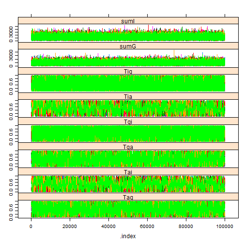

<!-- Specify the report's official name, goal & description. -->
# Contagion results
**Report Goal**:  Provide a minimalistic report prototype for future reports.
**Report Description**: This is a prototype of a simple report.  It should represent the one side of the spectrum of MIECHV automated reports..

<!-- Point knitr to the underlying code file so it knows where to look for the chunks. -->


### Cohort: 1980

```r
cohortYear <- 1980
```


```r
require(rjags)
```

```
## Loading required package: rjags
```

```
## Loading required package: coda
```

```
## Loading required package: lattice
```

```
## linking to JAGS 3.3.0
```

```
## module basemod loaded
```

```
## module bugs loaded
```

```r


if (Sys.info()["nodename"] == "MICKEY") pathDirectory <- "F:/Users/wibeasley/Documents/Consulting/EmosaMcmc/Dev/EMOSA"
# pathDirectory <-
# 'F:/Users/wibeasley/Documents/Consulting/EmosaMcmc/Dev/EMOSA/OneShot_Only1984Diffusion'
if (Sys.info()["nodename"] == "MERKANEZ-PC") pathDirectory <- "F:/Users/wibeasley/Documents/SSuccess/InterimStudy"  #Change this directory location

# pathModel <- file.path(pathDirectory,
# 'ContagionOnly/ContagionGauss.bugs')
pathModel <- file.path(pathDirectory, "ContagionOnly/ContagionBeta.bugs")
pathData <- file.path(pathDirectory, "Data/SummaryBirthYearByTime.csv")


ds <- read.csv(pathData, stringsAsFactors = FALSE)
ds <- ds[ds$byear == cohortYear, ]  #Select only the desired cohort
ds <- ds[order(ds$time), ]  #Sort, just, to make sure values will be passed to JAGS in the correct order.

pg <- ds$ProportionGoers
pi <- ds$ProportionIrregulars
pa <- ds$ProportionAbsentees

# Proportion of Goers, of Irregulars, or Nongoers (or absentees) {Check
# these with data; I may have messed up the order} For the 1984 cohort pg
# <- c(0.401088929, 0.340290381, 0.249546279, 0.218693285, 0.180580762,
# 0.167876588, 0.157894737, 0.158802178, 0.161524501) pi <- c(0.233212341,
# 0.256805808, 0.288566243, 0.305807623, 0.27676951, 0.270417423,
# 0.229582577, 0.250453721, 0.237749546) pa <- c(0.36569873, 0.402903811,
# 0.461887477, 0.475499093, 0.542649728, 0.561705989, 0.612522686,
# 0.590744102, 0.600725953)
timeCount <- length(pg)
if (length(pi) != timeCount) stop("The proportions have a different number of time points.")
if (length(pa) != timeCount) stop("The proportions have a different number of time points.")
mean(c(pg, pi, pa))
```

```
## [1] 0.3333
```

```r

jagsData <- list(pg = pg, pi = pi, pa = pa, timeCount = timeCount)

parametersToTrack <- c("Tgi", "Tga", "Tig", "Tia", "Tag", "Tai", "sumG", "sumI")  #For Beta
# parametersToTrack <- c('Tgi', 'Tga', 'Tig', 'Tia', 'Tag', 'Tai',
# 'sigmaG', 'sigmaI') #For Gauss

countChains <- 3  #3 #6
countIterations <- 1e+05

startTime <- Sys.time()

jagsModel <- jags.model(file = pathModel, data = jagsData, n.chains = countChains)  #, inits=inits)
```

```
## Compiling model graph
##    Resolving undeclared variables
##    Allocating nodes
##    Graph Size: 185
## 
## Initializing model
```

```r
# print(jagsModel) update(jagsModel, 1000) #modifies the original object
# and returns NULL dic <- dic.samples(jagsModel, n.iter=countIterations)
# mcarray <- jags.samples(model=jagsModel, c('mu'),
# n.iter=countIterations) #If I understand correctly, the following line
# is similar, but better
chains <- coda.samples(jagsModel, variable.names = parametersToTrack, n.iter = countIterations)  # updates the model, and coerces the output to a single mcmc.list object.
elapsed <- Sys.time() - startTime
(condensed <- summary(chains))
```

```
## 
## Iterations = 1001:101000
## Thinning interval = 1 
## Number of chains = 3 
## Sample size per chain = 1e+05 
## 
## 1. Empirical mean and standard deviation for each variable,
##    plus standard error of the mean:
## 
##          Mean      SD Naive SE Time-series SE
## Tag     0.535   0.263 0.000480        0.00461
## Tai     0.459   0.263 0.000481        0.00802
## Tga     0.479   0.263 0.000480        0.00470
## Tgi     0.583   0.271 0.000495        0.00331
## Tia     0.524   0.264 0.000482        0.00802
## Tig     0.425   0.272 0.000496        0.00325
## sumG  801.557 378.382 0.690827        1.09110
## sumI 1124.501 534.509 0.975875        1.65086
## 
## 2. Quantiles for each variable:
## 
##          2.5%     25%      50%      75%    97.5%
## Tag    0.0524   0.324    0.544    0.753    0.969
## Tai    0.0286   0.235    0.453    0.677    0.932
## Tga    0.0319   0.261    0.476    0.690    0.951
## Tgi    0.0516   0.372    0.617    0.814    0.981
## Tia    0.0613   0.305    0.522    0.747    0.969
## Tig    0.0197   0.192    0.396    0.637    0.951
## sumG 241.7673 525.199  742.185 1015.111 1695.064
## sumI 335.4756 734.459 1040.166 1422.216 2393.084
```

```r

# windows() # dev.off()
gelman.diag(chains, autoburnin = FALSE)  #This is R-hat; the burnin period is manually specified above, so turn off the auto argument.
```

```
## Potential scale reduction factors:
## 
##      Point est. Upper C.I.
## Tag           1          1
## Tai           1          1
## Tga           1          1
## Tgi           1          1
## Tia           1          1
## Tig           1          1
## sumG          1          1
## sumI          1          1
## 
## Multivariate psrf
## 
## 1
```

```r
effectiveSize(chains)  #Sample size adjusted for autocorrelation
```

```
##    Tag    Tai    Tga    Tgi    Tia    Tig   sumG   sumI 
##   3374   1324   3422   6979   1309   6998 119629 108951
```

```r

xyplot(chains)  #Needs at least two parameters; else throws an error.
```

 

```r
densityplot(chains)
```

 

```r
# gelman.plot(chains)
elapsed
```

```
## Time difference of 1.033 mins
```


### Cohort: 1981

```r
cohortYear <- 1981
```


```r
require(rjags)


if (Sys.info()["nodename"] == "MICKEY") pathDirectory <- "F:/Users/wibeasley/Documents/Consulting/EmosaMcmc/Dev/EMOSA"
# pathDirectory <-
# 'F:/Users/wibeasley/Documents/Consulting/EmosaMcmc/Dev/EMOSA/OneShot_Only1984Diffusion'
if (Sys.info()["nodename"] == "MERKANEZ-PC") pathDirectory <- "F:/Users/wibeasley/Documents/SSuccess/InterimStudy"  #Change this directory location

# pathModel <- file.path(pathDirectory,
# 'ContagionOnly/ContagionGauss.bugs')
pathModel <- file.path(pathDirectory, "ContagionOnly/ContagionBeta.bugs")
pathData <- file.path(pathDirectory, "Data/SummaryBirthYearByTime.csv")


ds <- read.csv(pathData, stringsAsFactors = FALSE)
ds <- ds[ds$byear == cohortYear, ]  #Select only the desired cohort
ds <- ds[order(ds$time), ]  #Sort, just, to make sure values will be passed to JAGS in the correct order.

pg <- ds$ProportionGoers
pi <- ds$ProportionIrregulars
pa <- ds$ProportionAbsentees

# Proportion of Goers, of Irregulars, or Nongoers (or absentees) {Check
# these with data; I may have messed up the order} For the 1984 cohort pg
# <- c(0.401088929, 0.340290381, 0.249546279, 0.218693285, 0.180580762,
# 0.167876588, 0.157894737, 0.158802178, 0.161524501) pi <- c(0.233212341,
# 0.256805808, 0.288566243, 0.305807623, 0.27676951, 0.270417423,
# 0.229582577, 0.250453721, 0.237749546) pa <- c(0.36569873, 0.402903811,
# 0.461887477, 0.475499093, 0.542649728, 0.561705989, 0.612522686,
# 0.590744102, 0.600725953)
timeCount <- length(pg)
if (length(pi) != timeCount) stop("The proportions have a different number of time points.")
if (length(pa) != timeCount) stop("The proportions have a different number of time points.")
mean(c(pg, pi, pa))
```

```
## [1] 0.3333
```

```r

jagsData <- list(pg = pg, pi = pi, pa = pa, timeCount = timeCount)

parametersToTrack <- c("Tgi", "Tga", "Tig", "Tia", "Tag", "Tai", "sumG", "sumI")  #For Beta
# parametersToTrack <- c('Tgi', 'Tga', 'Tig', 'Tia', 'Tag', 'Tai',
# 'sigmaG', 'sigmaI') #For Gauss

countChains <- 3  #3 #6
countIterations <- 1e+05

startTime <- Sys.time()

jagsModel <- jags.model(file = pathModel, data = jagsData, n.chains = countChains)  #, inits=inits)
```

```
## Compiling model graph
##    Resolving undeclared variables
##    Allocating nodes
##    Graph Size: 185
## 
## Initializing model
```

```r
# print(jagsModel) update(jagsModel, 1000) #modifies the original object
# and returns NULL dic <- dic.samples(jagsModel, n.iter=countIterations)
# mcarray <- jags.samples(model=jagsModel, c('mu'),
# n.iter=countIterations) #If I understand correctly, the following line
# is similar, but better
chains <- coda.samples(jagsModel, variable.names = parametersToTrack, n.iter = countIterations)  # updates the model, and coerces the output to a single mcmc.list object.
elapsed <- Sys.time() - startTime
(condensed <- summary(chains))
```

```
## 
## Iterations = 1001:101000
## Thinning interval = 1 
## Number of chains = 3 
## Sample size per chain = 1e+05 
## 
## 1. Empirical mean and standard deviation for each variable,
##    plus standard error of the mean:
## 
##          Mean      SD Naive SE Time-series SE
## Tag     0.529   0.261 0.000476        0.00602
## Tai     0.430   0.251 0.000458        0.00700
## Tga     0.463   0.265 0.000483        0.00608
## Tgi     0.618   0.251 0.000458        0.00415
## Tia     0.570   0.252 0.000459        0.00720
## Tig     0.385   0.252 0.000460        0.00385
## sumG 1269.252 643.517 1.174896        3.57145
## sumI 1358.536 648.964 1.184841        2.25184
## 
## 2. Quantiles for each variable:
## 
##          2.5%     25%      50%      75%    97.5%
## Tag    0.0566   0.320    0.533    0.744    0.969
## Tai    0.0236   0.217    0.423    0.633    0.889
## Tga    0.0297   0.239    0.456    0.676    0.945
## Tgi    0.0917   0.437    0.650    0.828    0.982
## Tia    0.1073   0.368    0.576    0.784    0.977
## Tig    0.0182   0.175    0.352    0.566    0.914
## sumG 357.0384 801.531 1155.086 1614.291 2825.531
## sumI 402.9858 884.168 1255.115 1720.357 2900.138
```

```r

# windows() # dev.off()
gelman.diag(chains, autoburnin = FALSE)  #This is R-hat; the burnin period is manually specified above, so turn off the auto argument.
```

```
## Potential scale reduction factors:
## 
##      Point est. Upper C.I.
## Tag           1       1.00
## Tai           1       1.01
## Tga           1       1.00
## Tgi           1       1.00
## Tia           1       1.00
## Tig           1       1.00
## sumG          1       1.00
## sumI          1       1.00
## 
## Multivariate psrf
## 
## 1
```

```r
effectiveSize(chains)  #Sample size adjusted for autocorrelation
```

```
##   Tag   Tai   Tga   Tgi   Tia   Tig  sumG  sumI 
##  2057  1513  2087  4196  1456  4225 36275 91456
```

```r

xyplot(chains)  #Needs at least two parameters; else throws an error.
```

 

```r
densityplot(chains)
```

 

```r
# gelman.plot(chains)
elapsed
```

```
## Time difference of 59.71 secs
```


### Cohort: 1982

```r
cohortYear <- 1982
```


```r
require(rjags)


if (Sys.info()["nodename"] == "MICKEY") pathDirectory <- "F:/Users/wibeasley/Documents/Consulting/EmosaMcmc/Dev/EMOSA"
# pathDirectory <-
# 'F:/Users/wibeasley/Documents/Consulting/EmosaMcmc/Dev/EMOSA/OneShot_Only1984Diffusion'
if (Sys.info()["nodename"] == "MERKANEZ-PC") pathDirectory <- "F:/Users/wibeasley/Documents/SSuccess/InterimStudy"  #Change this directory location

# pathModel <- file.path(pathDirectory,
# 'ContagionOnly/ContagionGauss.bugs')
pathModel <- file.path(pathDirectory, "ContagionOnly/ContagionBeta.bugs")
pathData <- file.path(pathDirectory, "Data/SummaryBirthYearByTime.csv")


ds <- read.csv(pathData, stringsAsFactors = FALSE)
ds <- ds[ds$byear == cohortYear, ]  #Select only the desired cohort
ds <- ds[order(ds$time), ]  #Sort, just, to make sure values will be passed to JAGS in the correct order.

pg <- ds$ProportionGoers
pi <- ds$ProportionIrregulars
pa <- ds$ProportionAbsentees

# Proportion of Goers, of Irregulars, or Nongoers (or absentees) {Check
# these with data; I may have messed up the order} For the 1984 cohort pg
# <- c(0.401088929, 0.340290381, 0.249546279, 0.218693285, 0.180580762,
# 0.167876588, 0.157894737, 0.158802178, 0.161524501) pi <- c(0.233212341,
# 0.256805808, 0.288566243, 0.305807623, 0.27676951, 0.270417423,
# 0.229582577, 0.250453721, 0.237749546) pa <- c(0.36569873, 0.402903811,
# 0.461887477, 0.475499093, 0.542649728, 0.561705989, 0.612522686,
# 0.590744102, 0.600725953)
timeCount <- length(pg)
if (length(pi) != timeCount) stop("The proportions have a different number of time points.")
if (length(pa) != timeCount) stop("The proportions have a different number of time points.")
mean(c(pg, pi, pa))
```

```
## [1] 0.3333
```

```r

jagsData <- list(pg = pg, pi = pi, pa = pa, timeCount = timeCount)

parametersToTrack <- c("Tgi", "Tga", "Tig", "Tia", "Tag", "Tai", "sumG", "sumI")  #For Beta
# parametersToTrack <- c('Tgi', 'Tga', 'Tig', 'Tia', 'Tag', 'Tai',
# 'sigmaG', 'sigmaI') #For Gauss

countChains <- 3  #3 #6
countIterations <- 1e+05

startTime <- Sys.time()

jagsModel <- jags.model(file = pathModel, data = jagsData, n.chains = countChains)  #, inits=inits)
```

```
## Compiling model graph
##    Resolving undeclared variables
##    Allocating nodes
##    Graph Size: 185
## 
## Initializing model
```

```r
# print(jagsModel) update(jagsModel, 1000) #modifies the original object
# and returns NULL dic <- dic.samples(jagsModel, n.iter=countIterations)
# mcarray <- jags.samples(model=jagsModel, c('mu'),
# n.iter=countIterations) #If I understand correctly, the following line
# is similar, but better
chains <- coda.samples(jagsModel, variable.names = parametersToTrack, n.iter = countIterations)  # updates the model, and coerces the output to a single mcmc.list object.
elapsed <- Sys.time() - startTime
(condensed <- summary(chains))
```

```
## 
## Iterations = 1001:101000
## Thinning interval = 1 
## Number of chains = 3 
## Sample size per chain = 1e+05 
## 
## 1. Empirical mean and standard deviation for each variable,
##    plus standard error of the mean:
## 
##         Mean      SD Naive SE Time-series SE
## Tag    0.562   0.257 0.000469        0.00299
## Tai    0.405   0.242 0.000443        0.00544
## Tga    0.449   0.257 0.000470        0.00286
## Tgi    0.674   0.234 0.000428        0.00219
## Tia    0.598   0.242 0.000443        0.00543
## Tig    0.322   0.233 0.000425        0.00229
## sumG 301.767 144.736 0.264251        0.41035
## sumI 972.275 471.991 0.861734        1.61241
## 
## 2. Quantiles for each variable:
## 
##          2.5%     25%     50%      75%    97.5%
## Tag    0.0755   0.360   0.572    0.777    0.975
## Tai    0.0204   0.197   0.399    0.601    0.856
## Tga    0.0268   0.233   0.444    0.652    0.927
## Tgi    0.1390   0.519   0.717    0.868    0.987
## Tia    0.1441   0.404   0.606    0.808    0.981
## Tig    0.0127   0.130   0.278    0.473    0.860
## sumG  89.9482 196.728 278.197  381.681  646.121
## sumI 283.7792 627.237 895.623 1235.619 2094.526
```

```r

# windows() # dev.off()
gelman.diag(chains, autoburnin = FALSE)  #This is R-hat; the burnin period is manually specified above, so turn off the auto argument.
```

```
## Potential scale reduction factors:
## 
##      Point est. Upper C.I.
## Tag           1          1
## Tai           1          1
## Tga           1          1
## Tgi           1          1
## Tia           1          1
## Tig           1          1
## sumG          1          1
## sumI          1          1
## 
## Multivariate psrf
## 
## 1
```

```r
effectiveSize(chains)  #Sample size adjusted for autocorrelation
```

```
##    Tag    Tai    Tga    Tgi    Tia    Tig   sumG   sumI 
##   7617   2071   7857  10516   2097  10493 103839  86311
```

```r

xyplot(chains)  #Needs at least two parameters; else throws an error.
```

 

```r
densityplot(chains)
```

 

```r
# gelman.plot(chains)
elapsed
```

```
## Time difference of 1.042 mins
```


### Cohort: 1983

```r
cohortYear <- 1983
```


```r
require(rjags)


if (Sys.info()["nodename"] == "MICKEY") pathDirectory <- "F:/Users/wibeasley/Documents/Consulting/EmosaMcmc/Dev/EMOSA"
# pathDirectory <-
# 'F:/Users/wibeasley/Documents/Consulting/EmosaMcmc/Dev/EMOSA/OneShot_Only1984Diffusion'
if (Sys.info()["nodename"] == "MERKANEZ-PC") pathDirectory <- "F:/Users/wibeasley/Documents/SSuccess/InterimStudy"  #Change this directory location

# pathModel <- file.path(pathDirectory,
# 'ContagionOnly/ContagionGauss.bugs')
pathModel <- file.path(pathDirectory, "ContagionOnly/ContagionBeta.bugs")
pathData <- file.path(pathDirectory, "Data/SummaryBirthYearByTime.csv")


ds <- read.csv(pathData, stringsAsFactors = FALSE)
ds <- ds[ds$byear == cohortYear, ]  #Select only the desired cohort
ds <- ds[order(ds$time), ]  #Sort, just, to make sure values will be passed to JAGS in the correct order.

pg <- ds$ProportionGoers
pi <- ds$ProportionIrregulars
pa <- ds$ProportionAbsentees

# Proportion of Goers, of Irregulars, or Nongoers (or absentees) {Check
# these with data; I may have messed up the order} For the 1984 cohort pg
# <- c(0.401088929, 0.340290381, 0.249546279, 0.218693285, 0.180580762,
# 0.167876588, 0.157894737, 0.158802178, 0.161524501) pi <- c(0.233212341,
# 0.256805808, 0.288566243, 0.305807623, 0.27676951, 0.270417423,
# 0.229582577, 0.250453721, 0.237749546) pa <- c(0.36569873, 0.402903811,
# 0.461887477, 0.475499093, 0.542649728, 0.561705989, 0.612522686,
# 0.590744102, 0.600725953)
timeCount <- length(pg)
if (length(pi) != timeCount) stop("The proportions have a different number of time points.")
if (length(pa) != timeCount) stop("The proportions have a different number of time points.")
mean(c(pg, pi, pa))
```

```
## [1] 0.3333
```

```r

jagsData <- list(pg = pg, pi = pi, pa = pa, timeCount = timeCount)

parametersToTrack <- c("Tgi", "Tga", "Tig", "Tia", "Tag", "Tai", "sumG", "sumI")  #For Beta
# parametersToTrack <- c('Tgi', 'Tga', 'Tig', 'Tia', 'Tag', 'Tai',
# 'sigmaG', 'sigmaI') #For Gauss

countChains <- 3  #3 #6
countIterations <- 1e+05

startTime <- Sys.time()

jagsModel <- jags.model(file = pathModel, data = jagsData, n.chains = countChains)  #, inits=inits)
```

```
## Compiling model graph
##    Resolving undeclared variables
##    Allocating nodes
##    Graph Size: 185
## 
## Initializing model
```

```r
# print(jagsModel) update(jagsModel, 1000) #modifies the original object
# and returns NULL dic <- dic.samples(jagsModel, n.iter=countIterations)
# mcarray <- jags.samples(model=jagsModel, c('mu'),
# n.iter=countIterations) #If I understand correctly, the following line
# is similar, but better
chains <- coda.samples(jagsModel, variable.names = parametersToTrack, n.iter = countIterations)  # updates the model, and coerces the output to a single mcmc.list object.
elapsed <- Sys.time() - startTime
(condensed <- summary(chains))
```

```
## 
## Iterations = 1001:101000
## Thinning interval = 1 
## Number of chains = 3 
## Sample size per chain = 1e+05 
## 
## 1. Empirical mean and standard deviation for each variable,
##    plus standard error of the mean:
## 
##         Mean      SD Naive SE Time-series SE
## Tag    0.545   0.259 0.000472        0.00452
## Tai    0.385   0.226 0.000413        0.00348
## Tga    0.444   0.257 0.000469        0.00458
## Tgi    0.771   0.184 0.000336        0.00176
## Tia    0.621   0.225 0.000411        0.00356
## Tig    0.227   0.182 0.000332        0.00159
## sumG 643.573 317.786 0.580194        1.26783
## sumI 534.751 255.989 0.467369        0.83936
## 
## 2. Quantiles for each variable:
## 
##          2.5%      25%     50%     75%    97.5%
## Tag  7.55e-02   0.3363   0.548   0.764    0.973
## Tai  2.07e-02   0.1952   0.379   0.563    0.812
## Tga  2.56e-02   0.2265   0.438   0.652    0.919
## Tgi  3.16e-01   0.6681   0.815   0.917    0.992
## Tia  1.95e-01   0.4430   0.629   0.811    0.981
## Tig  7.63e-03   0.0829   0.184   0.328    0.679
## sumG 1.85e+02 411.8049 590.508 817.643 1405.063
## sumI 1.58e+02 347.3548 494.476 677.363 1145.073
```

```r

# windows() # dev.off()
gelman.diag(chains, autoburnin = FALSE)  #This is R-hat; the burnin period is manually specified above, so turn off the auto argument.
```

```
## Potential scale reduction factors:
## 
##      Point est. Upper C.I.
## Tag           1       1.00
## Tai           1       1.00
## Tga           1       1.01
## Tgi           1       1.00
## Tia           1       1.00
## Tig           1       1.00
## sumG          1       1.00
## sumI          1       1.00
## 
## Multivariate psrf
## 
## 1
```

```r
effectiveSize(chains)  #Sample size adjusted for autocorrelation
```

```
##   Tag   Tai   Tga   Tgi   Tia   Tig  sumG  sumI 
##  3560  4525  3534 13418  4566 13627 65443 97176
```

```r

xyplot(chains)  #Needs at least two parameters; else throws an error.
```

 

```r
densityplot(chains)
```

 

```r
# gelman.plot(chains)
elapsed
```

```
## Time difference of 1.038 mins
```


### Cohort: 1984

```r
cohortYear <- 1984
```


```r
require(rjags)


if (Sys.info()["nodename"] == "MICKEY") pathDirectory <- "F:/Users/wibeasley/Documents/Consulting/EmosaMcmc/Dev/EMOSA"
# pathDirectory <-
# 'F:/Users/wibeasley/Documents/Consulting/EmosaMcmc/Dev/EMOSA/OneShot_Only1984Diffusion'
if (Sys.info()["nodename"] == "MERKANEZ-PC") pathDirectory <- "F:/Users/wibeasley/Documents/SSuccess/InterimStudy"  #Change this directory location

# pathModel <- file.path(pathDirectory,
# 'ContagionOnly/ContagionGauss.bugs')
pathModel <- file.path(pathDirectory, "ContagionOnly/ContagionBeta.bugs")
pathData <- file.path(pathDirectory, "Data/SummaryBirthYearByTime.csv")


ds <- read.csv(pathData, stringsAsFactors = FALSE)
ds <- ds[ds$byear == cohortYear, ]  #Select only the desired cohort
ds <- ds[order(ds$time), ]  #Sort, just, to make sure values will be passed to JAGS in the correct order.

pg <- ds$ProportionGoers
pi <- ds$ProportionIrregulars
pa <- ds$ProportionAbsentees

# Proportion of Goers, of Irregulars, or Nongoers (or absentees) {Check
# these with data; I may have messed up the order} For the 1984 cohort pg
# <- c(0.401088929, 0.340290381, 0.249546279, 0.218693285, 0.180580762,
# 0.167876588, 0.157894737, 0.158802178, 0.161524501) pi <- c(0.233212341,
# 0.256805808, 0.288566243, 0.305807623, 0.27676951, 0.270417423,
# 0.229582577, 0.250453721, 0.237749546) pa <- c(0.36569873, 0.402903811,
# 0.461887477, 0.475499093, 0.542649728, 0.561705989, 0.612522686,
# 0.590744102, 0.600725953)
timeCount <- length(pg)
if (length(pi) != timeCount) stop("The proportions have a different number of time points.")
if (length(pa) != timeCount) stop("The proportions have a different number of time points.")
mean(c(pg, pi, pa))
```

```
## [1] 0.3333
```

```r

jagsData <- list(pg = pg, pi = pi, pa = pa, timeCount = timeCount)

parametersToTrack <- c("Tgi", "Tga", "Tig", "Tia", "Tag", "Tai", "sumG", "sumI")  #For Beta
# parametersToTrack <- c('Tgi', 'Tga', 'Tig', 'Tia', 'Tag', 'Tai',
# 'sigmaG', 'sigmaI') #For Gauss

countChains <- 3  #3 #6
countIterations <- 1e+05

startTime <- Sys.time()

jagsModel <- jags.model(file = pathModel, data = jagsData, n.chains = countChains)  #, inits=inits)
```

```
## Compiling model graph
##    Resolving undeclared variables
##    Allocating nodes
##    Graph Size: 185
## 
## Initializing model
```

```r
# print(jagsModel) update(jagsModel, 1000) #modifies the original object
# and returns NULL dic <- dic.samples(jagsModel, n.iter=countIterations)
# mcarray <- jags.samples(model=jagsModel, c('mu'),
# n.iter=countIterations) #If I understand correctly, the following line
# is similar, but better
chains <- coda.samples(jagsModel, variable.names = parametersToTrack, n.iter = countIterations)  # updates the model, and coerces the output to a single mcmc.list object.
elapsed <- Sys.time() - startTime
(condensed <- summary(chains))
```

```
## 
## Iterations = 1001:101000
## Thinning interval = 1 
## Number of chains = 3 
## Sample size per chain = 1e+05 
## 
## 1. Empirical mean and standard deviation for each variable,
##    plus standard error of the mean:
## 
##         Mean      SD Naive SE Time-series SE
## Tag    0.521   0.268 0.000490        0.00402
## Tai    0.381   0.230 0.000420        0.00365
## Tga    0.486   0.269 0.000492        0.00401
## Tgi    0.763   0.175 0.000320        0.00134
## Tia    0.613   0.230 0.000420        0.00355
## Tig    0.236   0.175 0.000319        0.00134
## sumG 443.940 223.857 0.408705        0.81616
## sumI 507.060 243.556 0.444670        0.70328
## 
## 2. Quantiles for each variable:
## 
##          2.5%      25%     50%     75%    97.5%
## Tag    0.0501   0.2960   0.526   0.747    0.968
## Tai    0.0181   0.1826   0.371   0.567    0.806
## Tga    0.0321   0.2570   0.487   0.711    0.951
## Tgi    0.3543   0.6541   0.796   0.905    0.991
## Tia    0.1924   0.4263   0.616   0.810    0.981
## Tig    0.0091   0.0955   0.204   0.343    0.647
## sumG 126.0952 280.9856 404.769 562.841  986.765
## sumI 149.6080 328.7176 467.767 642.939 1086.074
```

```r

# windows() # dev.off()
gelman.diag(chains, autoburnin = FALSE)  #This is R-hat; the burnin period is manually specified above, so turn off the auto argument.
```

```
## Potential scale reduction factors:
## 
##      Point est. Upper C.I.
## Tag           1          1
## Tai           1          1
## Tga           1          1
## Tgi           1          1
## Tia           1          1
## Tig           1          1
## sumG          1          1
## sumI          1          1
## 
## Multivariate psrf
## 
## 1
```

```r
effectiveSize(chains)  #Sample size adjusted for autocorrelation
```

```
##    Tag    Tai    Tga    Tgi    Tia    Tig   sumG   sumI 
##   4695   4510   4633  16813   4537  17531  73982 111467
```

```r

xyplot(chains)  #Needs at least two parameters; else throws an error.
```

 

```r
densityplot(chains)
```

 

```r
# gelman.plot(chains)
elapsed
```

```
## Time difference of 1.044 mins
```


