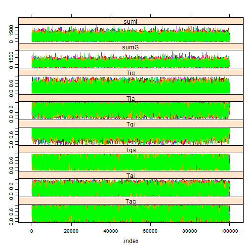

<!-- Specify the report's official name, goal & description. -->
# Contagion results
**Report Goal**:  Provide a minimalistic report prototype for future reports.
**Report Description**: This is a prototype of a simple report.  It should represent the one side of the spectrum of MIECHV automated reports..

<!-- Point knitr to the underlying code file so it knows where to look for the chunks. -->


### Cohort: 1980
Andrey -write something here.

```r
cohortYear <- 1980
```


```r
require(rjags)
```

```
## Loading required package: rjags
```

```
## Loading required package: coda
```

```
## Loading required package: lattice
```

```
## linking to JAGS 3.3.0
```

```
## module basemod loaded
```

```
## module bugs loaded
```

```r


if (Sys.info()["nodename"] == "MICKEY") pathDirectory <- "F:/Users/wibeasley/Documents/Consulting/EmosaMcmc/Dev/EMOSA"
# pathDirectory <-
# 'F:/Users/wibeasley/Documents/Consulting/EmosaMcmc/Dev/EMOSA/OneShot_Only1984Diffusion'
if (Sys.info()["nodename"] == "MERKANEZ-PC") pathDirectory <- "F:/Users/wibeasley/Documents/SSuccess/InterimStudy"  #Change this directory location

# pathModel <- file.path(pathDirectory,
# 'ContagionOnly/ContagionGauss.bugs')
pathModel <- file.path(pathDirectory, "ContagionOnly/ContagionBeta.bugs")
pathData <- file.path(pathDirectory, "Data/SummaryBirthYearByTime.csv")


ds <- read.csv(pathData, stringsAsFactors = FALSE)
ds <- ds[ds$byear == cohortYear, ]  #Select only the desired cohort
ds <- ds[order(ds$time), ]  #Sort, just, to make sure values will be passed to JAGS in the correct order.

pg <- ds$ProportionGoers
pi <- ds$ProportionIrregulars
pa <- ds$ProportionAbsentees

# Proportion of Goers, of Irregulars, or Nongoers (or absentees) {Check
# these with data; I may have messed up the order} For the 1984 cohort pg
# <- c(0.401088929, 0.340290381, 0.249546279, 0.218693285, 0.180580762,
# 0.167876588, 0.157894737, 0.158802178, 0.161524501) pi <- c(0.233212341,
# 0.256805808, 0.288566243, 0.305807623, 0.27676951, 0.270417423,
# 0.229582577, 0.250453721, 0.237749546) pa <- c(0.36569873, 0.402903811,
# 0.461887477, 0.475499093, 0.542649728, 0.561705989, 0.612522686,
# 0.590744102, 0.600725953)
timeCount <- length(pg)
if (length(pi) != timeCount) stop("The proportions have a different number of time points.")
if (length(pa) != timeCount) stop("The proportions have a different number of time points.")
mean(c(pg, pi, pa))
```

```
## [1] 0.3333
```

```r

jagsData <- list(pg = pg, pi = pi, pa = pa, timeCount = timeCount)

parametersToTrack <- c("Tgi", "Tga", "Tig", "Tia", "Tag", "Tai", "sumG", "sumI")  #For Beta
# parametersToTrack <- c('Tgi', 'Tga', 'Tig', 'Tia', 'Tag', 'Tai',
# 'sigmaG', 'sigmaI') #For Gauss

countChains <- 6  #3 #6
countIterations <- 1e+05

startTime <- Sys.time()

jagsModel <- jags.model(file = pathModel, data = jagsData, n.chains = countChains)  #, inits=inits)
```

```
## Compiling model graph
##    Resolving undeclared variables
##    Allocating nodes
##    Graph Size: 185
## 
## Initializing model
```

```r
# print(jagsModel) update(jagsModel, 1000) #modifies the original object
# and returns NULL
dic <- dic.samples(jagsModel, n.iter = countIterations)
dic
```

```
## Mean deviance:  -87.2 
## penalty 4.72 
## Penalized deviance: -82.5
```

```r
# mcarray <- jags.samples(model=jagsModel, c('mu'),
# n.iter=countIterations) #If I understand correctly, the following line
# is similar, but better
chains <- coda.samples(jagsModel, variable.names = parametersToTrack, n.iter = countIterations)  # updates the model, and coerces the output to a single mcmc.list object.
elapsed <- Sys.time() - startTime
(condensed <- summary(chains))
```

```
## 
## Iterations = 101001:201000
## Thinning interval = 1 
## Number of chains = 6 
## Sample size per chain = 1e+05 
## 
## 1. Empirical mean and standard deviation for each variable,
##    plus standard error of the mean:
## 
##          Mean      SD Naive SE Time-series SE
## Tag     0.528   0.264 0.000341        0.00333
## Tai     0.477   0.265 0.000342        0.00551
## Tga     0.474   0.264 0.000341        0.00324
## Tgi     0.580   0.269 0.000348        0.00229
## Tia     0.540   0.265 0.000342        0.00546
## Tig     0.426   0.272 0.000351        0.00231
## sumG  802.696 379.542 0.489987        0.83712
## sumI 1120.319 530.855 0.685331        1.17684
## 
## 2. Quantiles for each variable:
## 
##          2.5%     25%      50%      75%    97.5%
## Tag    0.0502   0.316    0.535    0.748    0.968
## Tai    0.0311   0.253    0.477    0.696    0.940
## Tga    0.0314   0.255    0.471    0.687    0.951
## Tgi    0.0536   0.371    0.608    0.809    0.981
## Tia    0.0656   0.322    0.545    0.766    0.972
## Tig    0.0195   0.193    0.398    0.640    0.950
## sumG 240.7764 525.423  743.150 1015.293 1699.975
## sumI 334.2983 732.611 1036.994 1417.416 2375.531
```

```r

# windows() # dev.off()
gelman.diag(chains, autoburnin = FALSE)  #This is R-hat; the burnin period is manually specified above, so turn off the auto argument.
```

```
## Potential scale reduction factors:
## 
##      Point est. Upper C.I.
## Tag           1          1
## Tai           1          1
## Tga           1          1
## Tgi           1          1
## Tia           1          1
## Tig           1          1
## sumG          1          1
## sumI          1          1
## 
## Multivariate psrf
## 
## 1
```

```r
effectiveSize(chains)  #Sample size adjusted for autocorrelation
```

```
##    Tag    Tai    Tga    Tgi    Tia    Tig   sumG   sumI 
##   6713   2728   6919  14088   2748  14025 234793 226439
```

```r

xyplot(chains)  #Needs at least two parameters; else throws an error.
```

 

```r
densityplot(chains)
```

 

```r
# gelman.plot(chains)
elapsed
```

```
## Time difference of 10.36 mins
```


### Cohort: 1981

```r
cohortYear <- 1981
```


```r
require(rjags)


if (Sys.info()["nodename"] == "MICKEY") pathDirectory <- "F:/Users/wibeasley/Documents/Consulting/EmosaMcmc/Dev/EMOSA"
# pathDirectory <-
# 'F:/Users/wibeasley/Documents/Consulting/EmosaMcmc/Dev/EMOSA/OneShot_Only1984Diffusion'
if (Sys.info()["nodename"] == "MERKANEZ-PC") pathDirectory <- "F:/Users/wibeasley/Documents/SSuccess/InterimStudy"  #Change this directory location

# pathModel <- file.path(pathDirectory,
# 'ContagionOnly/ContagionGauss.bugs')
pathModel <- file.path(pathDirectory, "ContagionOnly/ContagionBeta.bugs")
pathData <- file.path(pathDirectory, "Data/SummaryBirthYearByTime.csv")


ds <- read.csv(pathData, stringsAsFactors = FALSE)
ds <- ds[ds$byear == cohortYear, ]  #Select only the desired cohort
ds <- ds[order(ds$time), ]  #Sort, just, to make sure values will be passed to JAGS in the correct order.

pg <- ds$ProportionGoers
pi <- ds$ProportionIrregulars
pa <- ds$ProportionAbsentees

# Proportion of Goers, of Irregulars, or Nongoers (or absentees) {Check
# these with data; I may have messed up the order} For the 1984 cohort pg
# <- c(0.401088929, 0.340290381, 0.249546279, 0.218693285, 0.180580762,
# 0.167876588, 0.157894737, 0.158802178, 0.161524501) pi <- c(0.233212341,
# 0.256805808, 0.288566243, 0.305807623, 0.27676951, 0.270417423,
# 0.229582577, 0.250453721, 0.237749546) pa <- c(0.36569873, 0.402903811,
# 0.461887477, 0.475499093, 0.542649728, 0.561705989, 0.612522686,
# 0.590744102, 0.600725953)
timeCount <- length(pg)
if (length(pi) != timeCount) stop("The proportions have a different number of time points.")
if (length(pa) != timeCount) stop("The proportions have a different number of time points.")
mean(c(pg, pi, pa))
```

```
## [1] 0.3333
```

```r

jagsData <- list(pg = pg, pi = pi, pa = pa, timeCount = timeCount)

parametersToTrack <- c("Tgi", "Tga", "Tig", "Tia", "Tag", "Tai", "sumG", "sumI")  #For Beta
# parametersToTrack <- c('Tgi', 'Tga', 'Tig', 'Tia', 'Tag', 'Tai',
# 'sigmaG', 'sigmaI') #For Gauss

countChains <- 6  #3 #6
countIterations <- 1e+05

startTime <- Sys.time()

jagsModel <- jags.model(file = pathModel, data = jagsData, n.chains = countChains)  #, inits=inits)
```

```
## Compiling model graph
##    Resolving undeclared variables
##    Allocating nodes
##    Graph Size: 185
## 
## Initializing model
```

```r
# print(jagsModel) update(jagsModel, 1000) #modifies the original object
# and returns NULL
dic <- dic.samples(jagsModel, n.iter = countIterations)
dic
```

```
## Mean deviance:  -91.1 
## penalty 5.4 
## Penalized deviance: -85.7
```

```r
# mcarray <- jags.samples(model=jagsModel, c('mu'),
# n.iter=countIterations) #If I understand correctly, the following line
# is similar, but better
chains <- coda.samples(jagsModel, variable.names = parametersToTrack, n.iter = countIterations)  # updates the model, and coerces the output to a single mcmc.list object.
elapsed <- Sys.time() - startTime
(condensed <- summary(chains))
```

```
## 
## Iterations = 101001:201000
## Thinning interval = 1 
## Number of chains = 6 
## Sample size per chain = 1e+05 
## 
## 1. Empirical mean and standard deviation for each variable,
##    plus standard error of the mean:
## 
##          Mean      SD Naive SE Time-series SE
## Tag     0.537   0.263 0.000340        0.00422
## Tai     0.428   0.254 0.000328        0.00513
## Tga     0.470   0.263 0.000340        0.00420
## Tgi     0.627   0.249 0.000322        0.00288
## Tia     0.569   0.254 0.000328        0.00508
## Tig     0.392   0.253 0.000327        0.00284
## sumG 1270.318 644.671 0.832266        2.58216
## sumI 1355.672 649.259 0.838190        1.72464
## 
## 2. Quantiles for each variable:
## 
##          2.5%     25%      50%      75%    97.5%
## Tag    0.0577   0.325    0.543    0.757    0.971
## Tai    0.0225   0.211    0.420    0.633    0.897
## Tga    0.0299   0.250    0.466    0.683    0.944
## Tgi    0.0933   0.451    0.663    0.834    0.983
## Tia    0.1040   0.364    0.575    0.786    0.978
## Tig    0.0184   0.180    0.363    0.578    0.915
## sumG 355.9969 801.075 1156.084 1614.215 2830.819
## sumI 400.4664 881.336 1252.698 1719.134 2893.510
```

```r

# windows() # dev.off()
gelman.diag(chains, autoburnin = FALSE)  #This is R-hat; the burnin period is manually specified above, so turn off the auto argument.
```

```
## Potential scale reduction factors:
## 
##      Point est. Upper C.I.
## Tag           1          1
## Tai           1          1
## Tga           1          1
## Tgi           1          1
## Tia           1          1
## Tig           1          1
## sumG          1          1
## sumI          1          1
## 
## Multivariate psrf
## 
## 1
```

```r
effectiveSize(chains)  #Sample size adjusted for autocorrelation
```

```
##    Tag    Tai    Tga    Tgi    Tia    Tig   sumG   sumI 
##   3937   2849   4141   8466   2878   8458  70463 177294
```

```r

xyplot(chains)  #Needs at least two parameters; else throws an error.
```

 

```r
densityplot(chains)
```

 

```r
# gelman.plot(chains)
elapsed
```

```
## Time difference of 10.15 mins
```


### Cohort: 1982

```r
cohortYear <- 1982
```


```r
require(rjags)


if (Sys.info()["nodename"] == "MICKEY") pathDirectory <- "F:/Users/wibeasley/Documents/Consulting/EmosaMcmc/Dev/EMOSA"
# pathDirectory <-
# 'F:/Users/wibeasley/Documents/Consulting/EmosaMcmc/Dev/EMOSA/OneShot_Only1984Diffusion'
if (Sys.info()["nodename"] == "MERKANEZ-PC") pathDirectory <- "F:/Users/wibeasley/Documents/SSuccess/InterimStudy"  #Change this directory location

# pathModel <- file.path(pathDirectory,
# 'ContagionOnly/ContagionGauss.bugs')
pathModel <- file.path(pathDirectory, "ContagionOnly/ContagionBeta.bugs")
pathData <- file.path(pathDirectory, "Data/SummaryBirthYearByTime.csv")


ds <- read.csv(pathData, stringsAsFactors = FALSE)
ds <- ds[ds$byear == cohortYear, ]  #Select only the desired cohort
ds <- ds[order(ds$time), ]  #Sort, just, to make sure values will be passed to JAGS in the correct order.

pg <- ds$ProportionGoers
pi <- ds$ProportionIrregulars
pa <- ds$ProportionAbsentees

# Proportion of Goers, of Irregulars, or Nongoers (or absentees) {Check
# these with data; I may have messed up the order} For the 1984 cohort pg
# <- c(0.401088929, 0.340290381, 0.249546279, 0.218693285, 0.180580762,
# 0.167876588, 0.157894737, 0.158802178, 0.161524501) pi <- c(0.233212341,
# 0.256805808, 0.288566243, 0.305807623, 0.27676951, 0.270417423,
# 0.229582577, 0.250453721, 0.237749546) pa <- c(0.36569873, 0.402903811,
# 0.461887477, 0.475499093, 0.542649728, 0.561705989, 0.612522686,
# 0.590744102, 0.600725953)
timeCount <- length(pg)
if (length(pi) != timeCount) stop("The proportions have a different number of time points.")
if (length(pa) != timeCount) stop("The proportions have a different number of time points.")
mean(c(pg, pi, pa))
```

```
## [1] 0.3333
```

```r

jagsData <- list(pg = pg, pi = pi, pa = pa, timeCount = timeCount)

parametersToTrack <- c("Tgi", "Tga", "Tig", "Tia", "Tag", "Tai", "sumG", "sumI")  #For Beta
# parametersToTrack <- c('Tgi', 'Tga', 'Tig', 'Tia', 'Tag', 'Tai',
# 'sigmaG', 'sigmaI') #For Gauss

countChains <- 6  #3 #6
countIterations <- 1e+05

startTime <- Sys.time()

jagsModel <- jags.model(file = pathModel, data = jagsData, n.chains = countChains)  #, inits=inits)
```

```
## Compiling model graph
##    Resolving undeclared variables
##    Allocating nodes
##    Graph Size: 185
## 
## Initializing model
```

```r
# print(jagsModel) update(jagsModel, 1000) #modifies the original object
# and returns NULL
dic <- dic.samples(jagsModel, n.iter = countIterations)
dic
```

```
## Mean deviance:  -77.3 
## penalty 5.08 
## Penalized deviance: -72.2
```

```r
# mcarray <- jags.samples(model=jagsModel, c('mu'),
# n.iter=countIterations) #If I understand correctly, the following line
# is similar, but better
chains <- coda.samples(jagsModel, variable.names = parametersToTrack, n.iter = countIterations)  # updates the model, and coerces the output to a single mcmc.list object.
elapsed <- Sys.time() - startTime
(condensed <- summary(chains))
```

```
## 
## Iterations = 101001:201000
## Thinning interval = 1 
## Number of chains = 6 
## Sample size per chain = 1e+05 
## 
## 1. Empirical mean and standard deviation for each variable,
##    plus standard error of the mean:
## 
##         Mean      SD Naive SE Time-series SE
## Tag    0.557   0.257 0.000332        0.00204
## Tai    0.404   0.239 0.000308        0.00353
## Tga    0.443   0.257 0.000332        0.00197
## Tgi    0.678   0.233 0.000300        0.00161
## Tia    0.599   0.239 0.000308        0.00356
## Tig    0.324   0.233 0.000301        0.00167
## sumG 300.958 143.208 0.184881        0.34134
## sumI 970.219 466.860 0.602714        1.09634
## 
## 2. Quantiles for each variable:
## 
##          2.5%     25%     50%      75%    97.5%
## Tag    0.0753   0.354   0.566    0.774    0.975
## Tai    0.0209   0.202   0.398    0.593    0.854
## Tga    0.0258   0.227   0.435    0.646    0.926
## Tgi    0.1403   0.528   0.723    0.869    0.987
## Tia    0.1483   0.410   0.607    0.801    0.980
## Tig    0.0129   0.132   0.280    0.475    0.861
## sumG  90.3496 196.348 278.130  380.804  641.713
## sumI 283.9154 628.988 896.126 1230.747 2079.039
```

```r

# windows() # dev.off()
gelman.diag(chains, autoburnin = FALSE)  #This is R-hat; the burnin period is manually specified above, so turn off the auto argument.
```

```
## Potential scale reduction factors:
## 
##      Point est. Upper C.I.
## Tag           1       1.00
## Tai           1       1.01
## Tga           1       1.00
## Tgi           1       1.00
## Tia           1       1.01
## Tig           1       1.00
## sumG          1       1.00
## sumI          1       1.00
## 
## Multivariate psrf
## 
## 1
```

```r
effectiveSize(chains)  #Sample size adjusted for autocorrelation
```

```
##    Tag    Tai    Tga    Tgi    Tia    Tig   sumG   sumI 
##  15085   4510  15445  20639   4504  20245 215865 181863
```

```r

xyplot(chains)  #Needs at least two parameters; else throws an error.
```

 

```r
densityplot(chains)
```

 

```r
# gelman.plot(chains)
elapsed
```

```
## Time difference of 10.64 mins
```


### Cohort: 1983

```r
cohortYear <- 1983
```


```r
require(rjags)


if (Sys.info()["nodename"] == "MICKEY") pathDirectory <- "F:/Users/wibeasley/Documents/Consulting/EmosaMcmc/Dev/EMOSA"
# pathDirectory <-
# 'F:/Users/wibeasley/Documents/Consulting/EmosaMcmc/Dev/EMOSA/OneShot_Only1984Diffusion'
if (Sys.info()["nodename"] == "MERKANEZ-PC") pathDirectory <- "F:/Users/wibeasley/Documents/SSuccess/InterimStudy"  #Change this directory location

# pathModel <- file.path(pathDirectory,
# 'ContagionOnly/ContagionGauss.bugs')
pathModel <- file.path(pathDirectory, "ContagionOnly/ContagionBeta.bugs")
pathData <- file.path(pathDirectory, "Data/SummaryBirthYearByTime.csv")


ds <- read.csv(pathData, stringsAsFactors = FALSE)
ds <- ds[ds$byear == cohortYear, ]  #Select only the desired cohort
ds <- ds[order(ds$time), ]  #Sort, just, to make sure values will be passed to JAGS in the correct order.

pg <- ds$ProportionGoers
pi <- ds$ProportionIrregulars
pa <- ds$ProportionAbsentees

# Proportion of Goers, of Irregulars, or Nongoers (or absentees) {Check
# these with data; I may have messed up the order} For the 1984 cohort pg
# <- c(0.401088929, 0.340290381, 0.249546279, 0.218693285, 0.180580762,
# 0.167876588, 0.157894737, 0.158802178, 0.161524501) pi <- c(0.233212341,
# 0.256805808, 0.288566243, 0.305807623, 0.27676951, 0.270417423,
# 0.229582577, 0.250453721, 0.237749546) pa <- c(0.36569873, 0.402903811,
# 0.461887477, 0.475499093, 0.542649728, 0.561705989, 0.612522686,
# 0.590744102, 0.600725953)
timeCount <- length(pg)
if (length(pi) != timeCount) stop("The proportions have a different number of time points.")
if (length(pa) != timeCount) stop("The proportions have a different number of time points.")
mean(c(pg, pi, pa))
```

```
## [1] 0.3333
```

```r

jagsData <- list(pg = pg, pi = pi, pa = pa, timeCount = timeCount)

parametersToTrack <- c("Tgi", "Tga", "Tig", "Tia", "Tag", "Tai", "sumG", "sumI")  #For Beta
# parametersToTrack <- c('Tgi', 'Tga', 'Tig', 'Tia', 'Tag', 'Tai',
# 'sigmaG', 'sigmaI') #For Gauss

countChains <- 6  #3 #6
countIterations <- 1e+05

startTime <- Sys.time()

jagsModel <- jags.model(file = pathModel, data = jagsData, n.chains = countChains)  #, inits=inits)
```

```
## Compiling model graph
##    Resolving undeclared variables
##    Allocating nodes
##    Graph Size: 185
## 
## Initializing model
```

```r
# print(jagsModel) update(jagsModel, 1000) #modifies the original object
# and returns NULL
dic <- dic.samples(jagsModel, n.iter = countIterations)
dic
```

```
## Mean deviance:  -78.4 
## penalty 5.25 
## Penalized deviance: -73.2
```

```r
# mcarray <- jags.samples(model=jagsModel, c('mu'),
# n.iter=countIterations) #If I understand correctly, the following line
# is similar, but better
chains <- coda.samples(jagsModel, variable.names = parametersToTrack, n.iter = countIterations)  # updates the model, and coerces the output to a single mcmc.list object.
elapsed <- Sys.time() - startTime
(condensed <- summary(chains))
```

```
## 
## Iterations = 101001:201000
## Thinning interval = 1 
## Number of chains = 6 
## Sample size per chain = 1e+05 
## 
## 1. Empirical mean and standard deviation for each variable,
##    plus standard error of the mean:
## 
##         Mean      SD Naive SE Time-series SE
## Tag    0.551   0.259 0.000334        0.00313
## Tai    0.381   0.228 0.000295        0.00241
## Tga    0.450   0.259 0.000334        0.00309
## Tgi    0.772   0.183 0.000236        0.00110
## Tia    0.616   0.228 0.000294        0.00242
## Tig    0.229   0.184 0.000237        0.00113
## sumG 642.919 318.624 0.411342        0.76626
## sumI 533.813 255.921 0.330393        0.57703
## 
## 2. Quantiles for each variable:
## 
##          2.5%      25%     50%     75%    97.5%
## Tag  7.78e-02   0.3413   0.555   0.770    0.974
## Tai  1.86e-02   0.1876   0.372   0.562    0.813
## Tga  2.59e-02   0.2303   0.446   0.660    0.923
## Tgi  3.19e-01   0.6698   0.816   0.917    0.992
## Tia  1.87e-01   0.4368   0.622   0.810    0.981
## Tig  7.71e-03   0.0834   0.186   0.333    0.685
## sumG 1.85e+02 411.1096 588.845 815.688 1408.590
## sumI 1.58e+02 346.7457 493.026 676.468 1142.176
```

```r

# windows() # dev.off()
gelman.diag(chains, autoburnin = FALSE)  #This is R-hat; the burnin period is manually specified above, so turn off the auto argument.
```

```
## Potential scale reduction factors:
## 
##      Point est. Upper C.I.
## Tag           1          1
## Tai           1          1
## Tga           1          1
## Tgi           1          1
## Tia           1          1
## Tig           1          1
## sumG          1          1
## sumI          1          1
## 
## Multivariate psrf
## 
## 1
```

```r
effectiveSize(chains)  #Sample size adjusted for autocorrelation
```

```
##    Tag    Tai    Tga    Tgi    Tia    Tig   sumG   sumI 
##   7188   8795   7225  27496   8666  28439 145804 199644
```

```r

xyplot(chains)  #Needs at least two parameters; else throws an error.
```

 

```r
densityplot(chains)
```

 

```r
# gelman.plot(chains)
elapsed
```

```
## Time difference of 10.54 mins
```


### Cohort: 1984

```r
cohortYear <- 1984
```


```r
require(rjags)


if (Sys.info()["nodename"] == "MICKEY") pathDirectory <- "F:/Users/wibeasley/Documents/Consulting/EmosaMcmc/Dev/EMOSA"
# pathDirectory <-
# 'F:/Users/wibeasley/Documents/Consulting/EmosaMcmc/Dev/EMOSA/OneShot_Only1984Diffusion'
if (Sys.info()["nodename"] == "MERKANEZ-PC") pathDirectory <- "F:/Users/wibeasley/Documents/SSuccess/InterimStudy"  #Change this directory location

# pathModel <- file.path(pathDirectory,
# 'ContagionOnly/ContagionGauss.bugs')
pathModel <- file.path(pathDirectory, "ContagionOnly/ContagionBeta.bugs")
pathData <- file.path(pathDirectory, "Data/SummaryBirthYearByTime.csv")


ds <- read.csv(pathData, stringsAsFactors = FALSE)
ds <- ds[ds$byear == cohortYear, ]  #Select only the desired cohort
ds <- ds[order(ds$time), ]  #Sort, just, to make sure values will be passed to JAGS in the correct order.

pg <- ds$ProportionGoers
pi <- ds$ProportionIrregulars
pa <- ds$ProportionAbsentees

# Proportion of Goers, of Irregulars, or Nongoers (or absentees) {Check
# these with data; I may have messed up the order} For the 1984 cohort pg
# <- c(0.401088929, 0.340290381, 0.249546279, 0.218693285, 0.180580762,
# 0.167876588, 0.157894737, 0.158802178, 0.161524501) pi <- c(0.233212341,
# 0.256805808, 0.288566243, 0.305807623, 0.27676951, 0.270417423,
# 0.229582577, 0.250453721, 0.237749546) pa <- c(0.36569873, 0.402903811,
# 0.461887477, 0.475499093, 0.542649728, 0.561705989, 0.612522686,
# 0.590744102, 0.600725953)
timeCount <- length(pg)
if (length(pi) != timeCount) stop("The proportions have a different number of time points.")
if (length(pa) != timeCount) stop("The proportions have a different number of time points.")
mean(c(pg, pi, pa))
```

```
## [1] 0.3333
```

```r

jagsData <- list(pg = pg, pi = pi, pa = pa, timeCount = timeCount)

parametersToTrack <- c("Tgi", "Tga", "Tig", "Tia", "Tag", "Tai", "sumG", "sumI")  #For Beta
# parametersToTrack <- c('Tgi', 'Tga', 'Tig', 'Tia', 'Tag', 'Tai',
# 'sigmaG', 'sigmaI') #For Gauss

countChains <- 6  #3 #6
countIterations <- 1e+05

startTime <- Sys.time()

jagsModel <- jags.model(file = pathModel, data = jagsData, n.chains = countChains)  #, inits=inits)
```

```
## Compiling model graph
##    Resolving undeclared variables
##    Allocating nodes
##    Graph Size: 185
## 
## Initializing model
```

```r
# print(jagsModel) update(jagsModel, 1000) #modifies the original object
# and returns NULL
dic <- dic.samples(jagsModel, n.iter = countIterations)
dic
```

```
## Mean deviance:  -75 
## penalty 5.49 
## Penalized deviance: -69.5
```

```r
# mcarray <- jags.samples(model=jagsModel, c('mu'),
# n.iter=countIterations) #If I understand correctly, the following line
# is similar, but better
chains <- coda.samples(jagsModel, variable.names = parametersToTrack, n.iter = countIterations)  # updates the model, and coerces the output to a single mcmc.list object.
elapsed <- Sys.time() - startTime
(condensed <- summary(chains))
```

```
## 
## Iterations = 101001:201000
## Thinning interval = 1 
## Number of chains = 6 
## Sample size per chain = 1e+05 
## 
## 1. Empirical mean and standard deviation for each variable,
##    plus standard error of the mean:
## 
##         Mean      SD Naive SE Time-series SE
## Tag    0.517   0.266 0.000344       0.002712
## Tai    0.382   0.229 0.000296       0.002532
## Tga    0.481   0.267 0.000344       0.002734
## Tgi    0.765   0.175 0.000226       0.001061
## Tia    0.614   0.230 0.000296       0.002547
## Tig    0.237   0.176 0.000227       0.000971
## sumG 444.231 224.028 0.289219       0.593782
## sumI 505.607 242.577 0.313165       0.513103
## 
## 2. Quantiles for each variable:
## 
##          2.5%      25%     50%     75%    97.5%
## Tag  5.12e-02   0.2966   0.517   0.740    0.967
## Tai  1.84e-02   0.1846   0.375   0.566    0.805
## Tga  3.29e-02   0.2574   0.478   0.702    0.949
## Tgi  3.55e-01   0.6574   0.799   0.906    0.991
## Tia  1.93e-01   0.4290   0.620   0.810    0.981
## Tig  9.05e-03   0.0948   0.204   0.345    0.649
## sumG 1.27e+02 281.6904 404.509 563.829  986.262
## sumI 1.49e+02 328.1356 466.555 640.945 1082.837
```

```r

# windows() # dev.off()
gelman.diag(chains, autoburnin = FALSE)  #This is R-hat; the burnin period is manually specified above, so turn off the auto argument.
```

```
## Potential scale reduction factors:
## 
##      Point est. Upper C.I.
## Tag           1          1
## Tai           1          1
## Tga           1          1
## Tgi           1          1
## Tia           1          1
## Tig           1          1
## sumG          1          1
## sumI          1          1
## 
## Multivariate psrf
## 
## 1
```

```r
effectiveSize(chains)  #Sample size adjusted for autocorrelation
```

```
##    Tag    Tai    Tga    Tgi    Tia    Tig   sumG   sumI 
##   9367   9111   9376  34387   8995  34571 149410 221573
```

```r

xyplot(chains)  #Needs at least two parameters; else throws an error.
```

 

```r
densityplot(chains)
```

 

```r
# gelman.plot(chains)
elapsed
```

```
## Time difference of 10.69 mins
```


