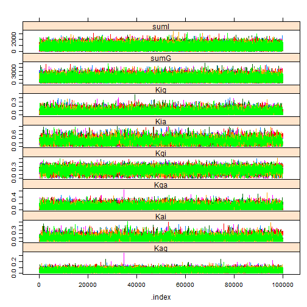
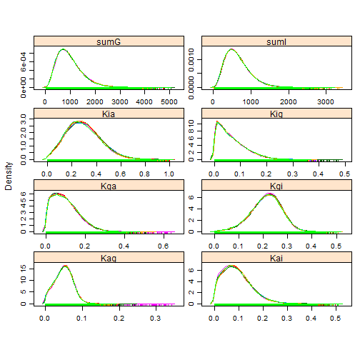

<!-- Specify the report's official name, goal & description. -->
# Diffusion results
**Report Goal**:  Provide a minimalistic report prototype for future reports.
**Report Description**: This is a prototype of a simple report.  It should represent the one side of the spectrum of MIECHV automated reports..

<!-- Point knitr to the underlying code file so it knows where to look for the chunks. -->


### Cohort: 1980

```r
cohortYear <- 1980
```


```r
require(rjags)
```

```
## Loading required package: rjags
```

```
## Loading required package: coda
```

```
## Loading required package: lattice
```

```
## linking to JAGS 3.3.0
```

```
## module basemod loaded
```

```
## module bugs loaded
```

```r


if (Sys.info()["nodename"] == "MICKEY") pathDirectory <- "F:/Users/wibeasley/Documents/Consulting/EmosaMcmc/Dev/EMOSA"
# pathDirectory <-
# 'F:/Users/wibeasley/Documents/Consulting/EmosaMcmc/Dev/EMOSA/OneShot_Only1984Diffusion'
if (Sys.info()["nodename"] == "MERKANEZ-PC") pathDirectory <- "F:/Users/wibeasley/Documents/SSuccess/InterimStudy"  #Change this directory location

# pathModel <- file.path(pathDirectory,
# 'DiffusionOnly/DiffusionGauss.bugs') pathModel <-
# file.path(pathDirectory, 'DiffusionOnly/DiffusionLogit.bugs')
pathModel <- file.path(pathDirectory, "DiffusionOnly/DiffusionBeta.bugs")
pathData <- file.path(pathDirectory, "Data/SummaryBirthYearByTime.csv")
# curve(dbeta(x, 1,1)) curve(dbeta(x, 10,10)) curve(dlogis(x, location =
# .25, scale = 1), xlim=c(-5, 5))


ds <- read.csv(pathData, stringsAsFactors = FALSE)
ds <- ds[ds$byear == cohortYear, ]  #Select only the desired cohort
ds <- ds[order(ds$time), ]  #Sort, just, to make sure values will be passed to JAGS in the correct order.

pg <- ds$ProportionGoers
pi <- ds$ProportionIrregulars
pa <- ds$ProportionAbsentees

# Proportion of Goers, of Irregulars, or Nongoers (or absentees) {Check
# these with data; I may have messed up the order} For the 1984 cohort pg
# <- c(0.401088929, 0.340290381, 0.249546279, 0.218693285, 0.180580762,
# 0.167876588, 0.157894737, 0.158802178, 0.161524501) pi <- c(0.233212341,
# 0.256805808, 0.288566243, 0.305807623, 0.27676951, 0.270417423,
# 0.229582577, 0.250453721, 0.237749546) pa <- c(0.36569873, 0.402903811,
# 0.461887477, 0.475499093, 0.542649728, 0.561705989, 0.612522686,
# 0.590744102, 0.600725953)
timeCount <- length(pg)
if (length(pi) != timeCount) stop("The proportions have a different number of time points.")
if (length(pa) != timeCount) stop("The proportions have a different number of time points.")
mean(c(pg, pi, pa))
```

```
## [1] 0.3333
```

```r

jagsData <- list(pg = pg, pi = pi, pa = pa, timeCount = timeCount)

# parameters <- c('mu')
parametersToTrack <- c("Kgi", "Kga", "Kig", "Kia", "Kag", "Kai", "sumG", "sumI")
# parametersToTrack <- c('Kgi', 'Kga', 'Kig', 'Kia', 'Kag', 'Kai', 'sumG',
# 'sumI', 'sumA') parametersToTrack <- c('Kgi', 'Kga', 'Kig', 'Kia',
# 'Kag', 'Kai', 'sigmaG', 'sigmaI') inits <- function(){
# list(Kgi=rnorm(1), Kga=rnorm(1), Kig=rnorm(1), Kia=rnorm(1),
# Kag=rnorm(1), Kai=rnorm(1)) }

countChains <- 6  #3 #6
countIterations <- 1e+05

startTime <- Sys.time()

jagsModel <- jags.model(file = pathModel, data = jagsData, n.chains = countChains)  #, inits=inits)
```

```
## Compiling model graph
##    Resolving undeclared variables
##    Allocating nodes
##    Graph Size: 183
## 
## Initializing model
```

```r
# print(jagsModel) update(jagsModel, 1000) #modifies the original object
# and returns NULL dic <- dic.samples(jagsModel, n.iter=countIterations)
# mcarray <- jags.samples(model=jagsModel, c('mu'),
# n.iter=countIterations) #If I understand correctly, the following line
# is similar, but better
chains <- coda.samples(jagsModel, variable.names = parametersToTrack, n.iter = countIterations)  # updates the model, and coerces the output to a single mcmc.list object.
elapsed <- Sys.time() - startTime
(condensed <- summary(chains))
```

```
## 
## Iterations = 1001:101000
## Thinning interval = 1 
## Number of chains = 6 
## Sample size per chain = 1e+05 
## 
## 1. Empirical mean and standard deviation for each variable,
##    plus standard error of the mean:
## 
##          Mean       SD Naive SE Time-series SE
## Kag  1.80e-01 6.49e-02 8.38e-05        0.00186
## Kai  9.05e-02 6.53e-02 8.44e-05        0.00151
## Kga  4.33e-01 2.44e-01 3.15e-04        0.00804
## Kgi  5.29e-01 2.14e-01 2.76e-04        0.00734
## Kia  3.06e-01 1.74e-01 2.25e-04        0.00543
## Kig  2.14e-01 1.19e-01 1.54e-04        0.00366
## sumG 2.07e+03 1.04e+03 1.34e+00        7.48277
## sumI 1.65e+03 8.29e+02 1.07e+00        6.52770
## 
## 2. Quantiles for each variable:
## 
##          2.5%      25%      50%      75%    97.5%
## Kag    0.0504    0.137 1.80e-01    0.222    0.309
## Kai    0.0044    0.040 7.85e-02    0.127    0.247
## Kga    0.0313    0.237 4.21e-01    0.611    0.919
## Kgi    0.0983    0.379 5.36e-01    0.685    0.931
## Kia    0.0269    0.175 2.89e-01    0.417    0.689
## Kig    0.0189    0.124 2.04e-01    0.292    0.472
## sumG 579.4133 1312.259 1.90e+03 2638.703 4564.056
## sumI 455.5629 1043.401 1.51e+03 2102.512 3636.297
```

```r

# windows() # dev.off()
gelman.diag(chains, autoburnin = FALSE)  #This is R-hat; the burnin period is manually specified above, so turn off the auto argument.
```

```
## Potential scale reduction factors:
## 
##      Point est. Upper C.I.
## Kag           1       1.00
## Kai           1       1.01
## Kga           1       1.01
## Kgi           1       1.01
## Kia           1       1.00
## Kig           1       1.00
## sumG          1       1.00
## sumI          1       1.00
## 
## Multivariate psrf
## 
## 1.01
```

```r
effectiveSize(chains)  #Sample size adjusted for autocorrelation
```

```
##   Kag   Kai   Kga   Kgi   Kia   Kig  sumG  sumI 
##  1443  2461  1182  1029  1462  1248 40874 36610
```

```r

xyplot(chains)  #Needs at least two parameters; else throws an error.
```

 

```r
densityplot(chains)
```

 

```r
# gelman.plot(chains) print(rbind(paste('estimated mu: ',
# condensed$statistics['mu0', 'Mean']), paste('observed mean:', mean(y,
# na.rm=T))))
elapsed
```

```
## Time difference of 2.071 mins
```


### Cohort: 1981

```r
cohortYear <- 1981
```


```r
require(rjags)


if (Sys.info()["nodename"] == "MICKEY") pathDirectory <- "F:/Users/wibeasley/Documents/Consulting/EmosaMcmc/Dev/EMOSA"
# pathDirectory <-
# 'F:/Users/wibeasley/Documents/Consulting/EmosaMcmc/Dev/EMOSA/OneShot_Only1984Diffusion'
if (Sys.info()["nodename"] == "MERKANEZ-PC") pathDirectory <- "F:/Users/wibeasley/Documents/SSuccess/InterimStudy"  #Change this directory location

# pathModel <- file.path(pathDirectory,
# 'DiffusionOnly/DiffusionGauss.bugs') pathModel <-
# file.path(pathDirectory, 'DiffusionOnly/DiffusionLogit.bugs')
pathModel <- file.path(pathDirectory, "DiffusionOnly/DiffusionBeta.bugs")
pathData <- file.path(pathDirectory, "Data/SummaryBirthYearByTime.csv")
# curve(dbeta(x, 1,1)) curve(dbeta(x, 10,10)) curve(dlogis(x, location =
# .25, scale = 1), xlim=c(-5, 5))


ds <- read.csv(pathData, stringsAsFactors = FALSE)
ds <- ds[ds$byear == cohortYear, ]  #Select only the desired cohort
ds <- ds[order(ds$time), ]  #Sort, just, to make sure values will be passed to JAGS in the correct order.

pg <- ds$ProportionGoers
pi <- ds$ProportionIrregulars
pa <- ds$ProportionAbsentees

# Proportion of Goers, of Irregulars, or Nongoers (or absentees) {Check
# these with data; I may have messed up the order} For the 1984 cohort pg
# <- c(0.401088929, 0.340290381, 0.249546279, 0.218693285, 0.180580762,
# 0.167876588, 0.157894737, 0.158802178, 0.161524501) pi <- c(0.233212341,
# 0.256805808, 0.288566243, 0.305807623, 0.27676951, 0.270417423,
# 0.229582577, 0.250453721, 0.237749546) pa <- c(0.36569873, 0.402903811,
# 0.461887477, 0.475499093, 0.542649728, 0.561705989, 0.612522686,
# 0.590744102, 0.600725953)
timeCount <- length(pg)
if (length(pi) != timeCount) stop("The proportions have a different number of time points.")
if (length(pa) != timeCount) stop("The proportions have a different number of time points.")
mean(c(pg, pi, pa))
```

```
## [1] 0.3333
```

```r

jagsData <- list(pg = pg, pi = pi, pa = pa, timeCount = timeCount)

# parameters <- c('mu')
parametersToTrack <- c("Kgi", "Kga", "Kig", "Kia", "Kag", "Kai", "sumG", "sumI")
# parametersToTrack <- c('Kgi', 'Kga', 'Kig', 'Kia', 'Kag', 'Kai', 'sumG',
# 'sumI', 'sumA') parametersToTrack <- c('Kgi', 'Kga', 'Kig', 'Kia',
# 'Kag', 'Kai', 'sigmaG', 'sigmaI') inits <- function(){
# list(Kgi=rnorm(1), Kga=rnorm(1), Kig=rnorm(1), Kia=rnorm(1),
# Kag=rnorm(1), Kai=rnorm(1)) }

countChains <- 6  #3 #6
countIterations <- 1e+05

startTime <- Sys.time()

jagsModel <- jags.model(file = pathModel, data = jagsData, n.chains = countChains)  #, inits=inits)
```

```
## Compiling model graph
##    Resolving undeclared variables
##    Allocating nodes
##    Graph Size: 185
## 
## Initializing model
```

```r
# print(jagsModel) update(jagsModel, 1000) #modifies the original object
# and returns NULL dic <- dic.samples(jagsModel, n.iter=countIterations)
# mcarray <- jags.samples(model=jagsModel, c('mu'),
# n.iter=countIterations) #If I understand correctly, the following line
# is similar, but better
chains <- coda.samples(jagsModel, variable.names = parametersToTrack, n.iter = countIterations)  # updates the model, and coerces the output to a single mcmc.list object.
elapsed <- Sys.time() - startTime
(condensed <- summary(chains))
```

```
## 
## Iterations = 1001:101000
## Thinning interval = 1 
## Number of chains = 6 
## Sample size per chain = 1e+05 
## 
## 1. Empirical mean and standard deviation for each variable,
##    plus standard error of the mean:
## 
##          Mean       SD Naive SE Time-series SE
## Kag  1.29e-01 3.78e-02 4.88e-05       6.38e-04
## Kai  5.94e-02 4.30e-02 5.55e-05       7.55e-04
## Kga  2.69e-01 1.64e-01 2.12e-04       5.91e-03
## Kgi  4.00e-01 1.80e-01 2.32e-04       7.15e-03
## Kia  1.97e-01 1.24e-01 1.60e-04       3.66e-03
## Kig  2.39e-01 1.14e-01 1.47e-04       3.77e-03
## sumG 3.23e+03 1.64e+03 2.11e+00       1.00e+01
## sumI 1.79e+03 9.02e+02 1.16e+00       5.71e+00
## 
## 2. Quantiles for each variable:
## 
##          2.5%      25%      50%      75%    97.5%
## Kag  5.64e-02 1.05e-01 1.29e-01 1.52e-01    0.208
## Kai  3.06e-03 2.68e-02 5.16e-02 8.26e-02    0.164
## Kga  1.56e-02 1.37e-01 2.56e-01 3.81e-01    0.615
## Kgi  6.29e-02 2.71e-01 3.98e-01 5.24e-01    0.757
## Kia  1.10e-02 9.80e-02 1.85e-01 2.80e-01    0.466
## Kig  3.45e-02 1.59e-01 2.36e-01 3.14e-01    0.477
## sumG 8.80e+02 2.04e+03 2.96e+03 4.13e+03 7160.365
## sumI 4.86e+02 1.13e+03 1.64e+03 2.29e+03 3945.611
```

```r

# windows() # dev.off()
gelman.diag(chains, autoburnin = FALSE)  #This is R-hat; the burnin period is manually specified above, so turn off the auto argument.
```

```
## Potential scale reduction factors:
## 
##      Point est. Upper C.I.
## Kag        1.00       1.00
## Kai        1.00       1.00
## Kga        1.00       1.01
## Kgi        1.01       1.02
## Kia        1.00       1.01
## Kig        1.00       1.01
## sumG       1.00       1.00
## sumI       1.00       1.00
## 
## Multivariate psrf
## 
## 1.01
```

```r
effectiveSize(chains)  #Sample size adjusted for autocorrelation
```

```
##     Kag     Kai     Kga     Kgi     Kia     Kig    sumG    sumI 
##  3854.9  5432.3  1253.9   776.1  2077.8  1112.1 45823.1 46023.0
```

```r

xyplot(chains)  #Needs at least two parameters; else throws an error.
```

 

```r
densityplot(chains)
```

 

```r
# gelman.plot(chains) print(rbind(paste('estimated mu: ',
# condensed$statistics['mu0', 'Mean']), paste('observed mean:', mean(y,
# na.rm=T))))
elapsed
```

```
## Time difference of 2.014 mins
```


### Cohort: 1982

```r
cohortYear <- 1982
```


```r
require(rjags)


if (Sys.info()["nodename"] == "MICKEY") pathDirectory <- "F:/Users/wibeasley/Documents/Consulting/EmosaMcmc/Dev/EMOSA"
# pathDirectory <-
# 'F:/Users/wibeasley/Documents/Consulting/EmosaMcmc/Dev/EMOSA/OneShot_Only1984Diffusion'
if (Sys.info()["nodename"] == "MERKANEZ-PC") pathDirectory <- "F:/Users/wibeasley/Documents/SSuccess/InterimStudy"  #Change this directory location

# pathModel <- file.path(pathDirectory,
# 'DiffusionOnly/DiffusionGauss.bugs') pathModel <-
# file.path(pathDirectory, 'DiffusionOnly/DiffusionLogit.bugs')
pathModel <- file.path(pathDirectory, "DiffusionOnly/DiffusionBeta.bugs")
pathData <- file.path(pathDirectory, "Data/SummaryBirthYearByTime.csv")
# curve(dbeta(x, 1,1)) curve(dbeta(x, 10,10)) curve(dlogis(x, location =
# .25, scale = 1), xlim=c(-5, 5))


ds <- read.csv(pathData, stringsAsFactors = FALSE)
ds <- ds[ds$byear == cohortYear, ]  #Select only the desired cohort
ds <- ds[order(ds$time), ]  #Sort, just, to make sure values will be passed to JAGS in the correct order.

pg <- ds$ProportionGoers
pi <- ds$ProportionIrregulars
pa <- ds$ProportionAbsentees

# Proportion of Goers, of Irregulars, or Nongoers (or absentees) {Check
# these with data; I may have messed up the order} For the 1984 cohort pg
# <- c(0.401088929, 0.340290381, 0.249546279, 0.218693285, 0.180580762,
# 0.167876588, 0.157894737, 0.158802178, 0.161524501) pi <- c(0.233212341,
# 0.256805808, 0.288566243, 0.305807623, 0.27676951, 0.270417423,
# 0.229582577, 0.250453721, 0.237749546) pa <- c(0.36569873, 0.402903811,
# 0.461887477, 0.475499093, 0.542649728, 0.561705989, 0.612522686,
# 0.590744102, 0.600725953)
timeCount <- length(pg)
if (length(pi) != timeCount) stop("The proportions have a different number of time points.")
if (length(pa) != timeCount) stop("The proportions have a different number of time points.")
mean(c(pg, pi, pa))
```

```
## [1] 0.3333
```

```r

jagsData <- list(pg = pg, pi = pi, pa = pa, timeCount = timeCount)

# parameters <- c('mu')
parametersToTrack <- c("Kgi", "Kga", "Kig", "Kia", "Kag", "Kai", "sumG", "sumI")
# parametersToTrack <- c('Kgi', 'Kga', 'Kig', 'Kia', 'Kag', 'Kai', 'sumG',
# 'sumI', 'sumA') parametersToTrack <- c('Kgi', 'Kga', 'Kig', 'Kia',
# 'Kag', 'Kai', 'sigmaG', 'sigmaI') inits <- function(){
# list(Kgi=rnorm(1), Kga=rnorm(1), Kig=rnorm(1), Kia=rnorm(1),
# Kag=rnorm(1), Kai=rnorm(1)) }

countChains <- 6  #3 #6
countIterations <- 1e+05

startTime <- Sys.time()

jagsModel <- jags.model(file = pathModel, data = jagsData, n.chains = countChains)  #, inits=inits)
```

```
## Compiling model graph
##    Resolving undeclared variables
##    Allocating nodes
##    Graph Size: 185
## 
## Initializing model
```

```r
# print(jagsModel) update(jagsModel, 1000) #modifies the original object
# and returns NULL dic <- dic.samples(jagsModel, n.iter=countIterations)
# mcarray <- jags.samples(model=jagsModel, c('mu'),
# n.iter=countIterations) #If I understand correctly, the following line
# is similar, but better
chains <- coda.samples(jagsModel, variable.names = parametersToTrack, n.iter = countIterations)  # updates the model, and coerces the output to a single mcmc.list object.
elapsed <- Sys.time() - startTime
(condensed <- summary(chains))
```

```
## 
## Iterations = 1001:101000
## Thinning interval = 1 
## Number of chains = 6 
## Sample size per chain = 1e+05 
## 
## 1. Empirical mean and standard deviation for each variable,
##    plus standard error of the mean:
## 
##          Mean       SD Naive SE Time-series SE
## Kag  1.08e-01 5.77e-02 7.45e-05       0.001470
## Kai  5.47e-02 3.42e-02 4.41e-05       0.000529
## Kga  2.07e-01 1.40e-01 1.81e-04       0.002602
## Kgi  6.57e-01 1.37e-01 1.77e-04       0.003670
## Kia  2.24e-01 1.44e-01 1.85e-04       0.004438
## Kig  4.31e-01 1.69e-01 2.18e-04       0.006433
## sumG 7.20e+02 3.60e+02 4.64e-01       1.926107
## sumI 2.70e+03 1.38e+03 1.78e+00       8.117569
## 
## 2. Quantiles for each variable:
## 
##          2.5%      25%      50%      75%    97.5%
## Kag  1.29e-02 6.62e-02 1.03e-01 1.44e-01    0.234
## Kai  4.11e-03 2.91e-02 5.03e-02 7.47e-02    0.133
## Kga  1.01e-02 9.57e-02 1.88e-01 2.95e-01    0.525
## Kgi  3.76e-01 5.70e-01 6.60e-01 7.50e-01    0.918
## Kia  1.24e-02 1.09e-01 2.07e-01 3.17e-01    0.542
## Kig  8.62e-02 3.17e-01 4.36e-01 5.49e-01    0.748
## sumG 1.98e+02 4.57e+02 6.60e+02 9.18e+02 1577.310
## sumI 7.09e+02 1.69e+03 2.47e+03 3.46e+03 6002.491
```

```r

# windows() # dev.off()
gelman.diag(chains, autoburnin = FALSE)  #This is R-hat; the burnin period is manually specified above, so turn off the auto argument.
```

```
## Potential scale reduction factors:
## 
##      Point est. Upper C.I.
## Kag        1.00       1.01
## Kai        1.00       1.00
## Kga        1.00       1.00
## Kgi        1.00       1.01
## Kia        1.00       1.01
## Kig        1.01       1.01
## sumG       1.00       1.00
## sumI       1.00       1.00
## 
## Multivariate psrf
## 
## 1.01
```

```r
effectiveSize(chains)  #Sample size adjusted for autocorrelation
```

```
##     Kag     Kai     Kga     Kgi     Kia     Kig    sumG    sumI 
##  3619.8  6230.4  5488.8  2116.7  1517.1   868.1 68598.9 43102.2
```

```r

xyplot(chains)  #Needs at least two parameters; else throws an error.
```

 

```r
densityplot(chains)
```

 

```r
# gelman.plot(chains) print(rbind(paste('estimated mu: ',
# condensed$statistics['mu0', 'Mean']), paste('observed mean:', mean(y,
# na.rm=T))))
elapsed
```

```
## Time difference of 2.063 mins
```


### Cohort: 1983

```r
cohortYear <- 1983
```


```r
require(rjags)


if (Sys.info()["nodename"] == "MICKEY") pathDirectory <- "F:/Users/wibeasley/Documents/Consulting/EmosaMcmc/Dev/EMOSA"
# pathDirectory <-
# 'F:/Users/wibeasley/Documents/Consulting/EmosaMcmc/Dev/EMOSA/OneShot_Only1984Diffusion'
if (Sys.info()["nodename"] == "MERKANEZ-PC") pathDirectory <- "F:/Users/wibeasley/Documents/SSuccess/InterimStudy"  #Change this directory location

# pathModel <- file.path(pathDirectory,
# 'DiffusionOnly/DiffusionGauss.bugs') pathModel <-
# file.path(pathDirectory, 'DiffusionOnly/DiffusionLogit.bugs')
pathModel <- file.path(pathDirectory, "DiffusionOnly/DiffusionBeta.bugs")
pathData <- file.path(pathDirectory, "Data/SummaryBirthYearByTime.csv")
# curve(dbeta(x, 1,1)) curve(dbeta(x, 10,10)) curve(dlogis(x, location =
# .25, scale = 1), xlim=c(-5, 5))


ds <- read.csv(pathData, stringsAsFactors = FALSE)
ds <- ds[ds$byear == cohortYear, ]  #Select only the desired cohort
ds <- ds[order(ds$time), ]  #Sort, just, to make sure values will be passed to JAGS in the correct order.

pg <- ds$ProportionGoers
pi <- ds$ProportionIrregulars
pa <- ds$ProportionAbsentees

# Proportion of Goers, of Irregulars, or Nongoers (or absentees) {Check
# these with data; I may have messed up the order} For the 1984 cohort pg
# <- c(0.401088929, 0.340290381, 0.249546279, 0.218693285, 0.180580762,
# 0.167876588, 0.157894737, 0.158802178, 0.161524501) pi <- c(0.233212341,
# 0.256805808, 0.288566243, 0.305807623, 0.27676951, 0.270417423,
# 0.229582577, 0.250453721, 0.237749546) pa <- c(0.36569873, 0.402903811,
# 0.461887477, 0.475499093, 0.542649728, 0.561705989, 0.612522686,
# 0.590744102, 0.600725953)
timeCount <- length(pg)
if (length(pi) != timeCount) stop("The proportions have a different number of time points.")
if (length(pa) != timeCount) stop("The proportions have a different number of time points.")
mean(c(pg, pi, pa))
```

```
## [1] 0.3333
```

```r

jagsData <- list(pg = pg, pi = pi, pa = pa, timeCount = timeCount)

# parameters <- c('mu')
parametersToTrack <- c("Kgi", "Kga", "Kig", "Kia", "Kag", "Kai", "sumG", "sumI")
# parametersToTrack <- c('Kgi', 'Kga', 'Kig', 'Kia', 'Kag', 'Kai', 'sumG',
# 'sumI', 'sumA') parametersToTrack <- c('Kgi', 'Kga', 'Kig', 'Kia',
# 'Kag', 'Kai', 'sigmaG', 'sigmaI') inits <- function(){
# list(Kgi=rnorm(1), Kga=rnorm(1), Kig=rnorm(1), Kia=rnorm(1),
# Kag=rnorm(1), Kai=rnorm(1)) }

countChains <- 6  #3 #6
countIterations <- 1e+05

startTime <- Sys.time()

jagsModel <- jags.model(file = pathModel, data = jagsData, n.chains = countChains)  #, inits=inits)
```

```
## Compiling model graph
##    Resolving undeclared variables
##    Allocating nodes
##    Graph Size: 183
## 
## Initializing model
```

```r
# print(jagsModel) update(jagsModel, 1000) #modifies the original object
# and returns NULL dic <- dic.samples(jagsModel, n.iter=countIterations)
# mcarray <- jags.samples(model=jagsModel, c('mu'),
# n.iter=countIterations) #If I understand correctly, the following line
# is similar, but better
chains <- coda.samples(jagsModel, variable.names = parametersToTrack, n.iter = countIterations)  # updates the model, and coerces the output to a single mcmc.list object.
elapsed <- Sys.time() - startTime
(condensed <- summary(chains))
```

```
## 
## Iterations = 1001:101000
## Thinning interval = 1 
## Number of chains = 6 
## Sample size per chain = 1e+05 
## 
## 1. Empirical mean and standard deviation for each variable,
##    plus standard error of the mean:
## 
##          Mean       SD Naive SE Time-series SE
## Kag  7.34e-02 1.92e-02 2.47e-05       3.74e-04
## Kai  9.24e-02 5.68e-02 7.33e-05       8.56e-04
## Kga  7.00e-02 5.99e-02 7.73e-05       1.55e-03
## Kgi  3.04e-01 6.40e-02 8.26e-05       1.68e-03
## Kia  3.53e-01 1.34e-01 1.72e-04       2.58e-03
## Kig  8.67e-02 5.15e-02 6.65e-05       1.09e-03
## sumG 9.85e+03 5.24e+03 6.77e+00       3.42e+01
## sumI 1.08e+03 5.60e+02 7.23e-01       4.75e+00
## 
## 2. Quantiles for each variable:
## 
##          2.5%      25%      50%      75%    97.5%
## Kag  3.13e-02 6.16e-02 7.50e-02 8.70e-02 1.06e-01
## Kai  6.96e-03 5.00e-02 8.55e-02 1.26e-01 2.21e-01
## Kga  2.18e-03 2.37e-02 5.39e-02 1.01e-01 2.23e-01
## Kgi  1.50e-01 2.70e-01 3.15e-01 3.48e-01 4.04e-01
## Kia  1.12e-01 2.60e-01 3.46e-01 4.38e-01 6.33e-01
## Kig  7.31e-03 4.81e-02 8.07e-02 1.18e-01 2.04e-01
## sumG 2.43e+03 6.01e+03 8.94e+03 1.27e+04 2.25e+04
## sumI 2.81e+02 6.68e+02 9.81e+02 1.38e+03 2.42e+03
```

```r

# windows() # dev.off()
gelman.diag(chains, autoburnin = FALSE)  #This is R-hat; the burnin period is manually specified above, so turn off the auto argument.
```

```
## Potential scale reduction factors:
## 
##      Point est. Upper C.I.
## Kag           1          1
## Kai           1          1
## Kga           1          1
## Kgi           1          1
## Kia           1          1
## Kig           1          1
## sumG          1          1
## sumI          1          1
## 
## Multivariate psrf
## 
## 1
```

```r
effectiveSize(chains)  #Sample size adjusted for autocorrelation
```

```
##   Kag   Kai   Kga   Kgi   Kia   Kig  sumG  sumI 
##  3495  5233  1959  2139  3741  2621 41015 28832
```

```r

xyplot(chains)  #Needs at least two parameters; else throws an error.
```

 

```r
densityplot(chains)
```

 

```r
# gelman.plot(chains) print(rbind(paste('estimated mu: ',
# condensed$statistics['mu0', 'Mean']), paste('observed mean:', mean(y,
# na.rm=T))))
elapsed
```

```
## Time difference of 2.055 hours
```


### Cohort: 1984

```r
cohortYear <- 1984
```


```r
require(rjags)


if (Sys.info()["nodename"] == "MICKEY") pathDirectory <- "F:/Users/wibeasley/Documents/Consulting/EmosaMcmc/Dev/EMOSA"
# pathDirectory <-
# 'F:/Users/wibeasley/Documents/Consulting/EmosaMcmc/Dev/EMOSA/OneShot_Only1984Diffusion'
if (Sys.info()["nodename"] == "MERKANEZ-PC") pathDirectory <- "F:/Users/wibeasley/Documents/SSuccess/InterimStudy"  #Change this directory location

# pathModel <- file.path(pathDirectory,
# 'DiffusionOnly/DiffusionGauss.bugs') pathModel <-
# file.path(pathDirectory, 'DiffusionOnly/DiffusionLogit.bugs')
pathModel <- file.path(pathDirectory, "DiffusionOnly/DiffusionBeta.bugs")
pathData <- file.path(pathDirectory, "Data/SummaryBirthYearByTime.csv")
# curve(dbeta(x, 1,1)) curve(dbeta(x, 10,10)) curve(dlogis(x, location =
# .25, scale = 1), xlim=c(-5, 5))


ds <- read.csv(pathData, stringsAsFactors = FALSE)
ds <- ds[ds$byear == cohortYear, ]  #Select only the desired cohort
ds <- ds[order(ds$time), ]  #Sort, just, to make sure values will be passed to JAGS in the correct order.

pg <- ds$ProportionGoers
pi <- ds$ProportionIrregulars
pa <- ds$ProportionAbsentees

# Proportion of Goers, of Irregulars, or Nongoers (or absentees) {Check
# these with data; I may have messed up the order} For the 1984 cohort pg
# <- c(0.401088929, 0.340290381, 0.249546279, 0.218693285, 0.180580762,
# 0.167876588, 0.157894737, 0.158802178, 0.161524501) pi <- c(0.233212341,
# 0.256805808, 0.288566243, 0.305807623, 0.27676951, 0.270417423,
# 0.229582577, 0.250453721, 0.237749546) pa <- c(0.36569873, 0.402903811,
# 0.461887477, 0.475499093, 0.542649728, 0.561705989, 0.612522686,
# 0.590744102, 0.600725953)
timeCount <- length(pg)
if (length(pi) != timeCount) stop("The proportions have a different number of time points.")
if (length(pa) != timeCount) stop("The proportions have a different number of time points.")
mean(c(pg, pi, pa))
```

```
## [1] 0.3333
```

```r

jagsData <- list(pg = pg, pi = pi, pa = pa, timeCount = timeCount)

# parameters <- c('mu')
parametersToTrack <- c("Kgi", "Kga", "Kig", "Kia", "Kag", "Kai", "sumG", "sumI")
# parametersToTrack <- c('Kgi', 'Kga', 'Kig', 'Kia', 'Kag', 'Kai', 'sumG',
# 'sumI', 'sumA') parametersToTrack <- c('Kgi', 'Kga', 'Kig', 'Kia',
# 'Kag', 'Kai', 'sigmaG', 'sigmaI') inits <- function(){
# list(Kgi=rnorm(1), Kga=rnorm(1), Kig=rnorm(1), Kia=rnorm(1),
# Kag=rnorm(1), Kai=rnorm(1)) }

countChains <- 6  #3 #6
countIterations <- 1e+05

startTime <- Sys.time()

jagsModel <- jags.model(file = pathModel, data = jagsData, n.chains = countChains)  #, inits=inits)
```

```
## Compiling model graph
##    Resolving undeclared variables
##    Allocating nodes
##    Graph Size: 185
## 
## Initializing model
```

```r
# print(jagsModel) update(jagsModel, 1000) #modifies the original object
# and returns NULL dic <- dic.samples(jagsModel, n.iter=countIterations)
# mcarray <- jags.samples(model=jagsModel, c('mu'),
# n.iter=countIterations) #If I understand correctly, the following line
# is similar, but better
chains <- coda.samples(jagsModel, variable.names = parametersToTrack, n.iter = countIterations)  # updates the model, and coerces the output to a single mcmc.list object.
elapsed <- Sys.time() - startTime
(condensed <- summary(chains))
```

```
## 
## Iterations = 1001:101000
## Thinning interval = 1 
## Number of chains = 6 
## Sample size per chain = 1e+05 
## 
## 1. Empirical mean and standard deviation for each variable,
##    plus standard error of the mean:
## 
##          Mean       SD Naive SE Time-series SE
## Kag    0.0505   0.0241 3.11e-05       0.000168
## Kai    0.0919   0.0591 7.63e-05       0.000788
## Kga    0.0976   0.0666 8.60e-05       0.000671
## Kgi    0.2126   0.0625 8.06e-05       0.000655
## Kia    0.2947   0.1424 1.84e-04       0.002021
## Kig    0.0657   0.0533 6.88e-05       0.000487
## sumG 969.9319 508.3459 6.56e-01       1.886756
## sumI 646.5536 325.3208 4.20e-01       1.152129
## 
## 2. Quantiles for each variable:
## 
##          2.5%      25%      50%      75%    97.5%
## Kag  5.45e-03   0.0334   0.0510 6.68e-02 9.74e-02
## Kai  6.14e-03   0.0471   0.0838 1.27e-01 2.29e-01
## Kga  4.91e-03   0.0450   0.0874 1.39e-01 2.51e-01
## Kgi  7.92e-02   0.1729   0.2164 2.56e-01 3.26e-01
## Kia  5.15e-02   0.1916   0.2828 3.84e-01 6.05e-01
## Kig  2.12e-03   0.0233   0.0530 9.61e-02 1.95e-01
## sumG 2.51e+02 598.3483 880.0617 1.24e+03 2.20e+03
## sumI 1.76e+02 407.8096 592.3110 8.27e+02 1.42e+03
```

```r

# windows() # dev.off()
gelman.diag(chains, autoburnin = FALSE)  #This is R-hat; the burnin period is manually specified above, so turn off the auto argument.
```

```
## Potential scale reduction factors:
## 
##      Point est. Upper C.I.
## Kag           1          1
## Kai           1          1
## Kga           1          1
## Kgi           1          1
## Kia           1          1
## Kig           1          1
## sumG          1          1
## sumI          1          1
## 
## Multivariate psrf
## 
## 1
```

```r
effectiveSize(chains)  #Sample size adjusted for autocorrelation
```

```
##   Kag   Kai   Kga   Kgi   Kia   Kig  sumG  sumI 
## 21050  7384 12601 11833  5919 12714 87143 98453
```

```r

xyplot(chains)  #Needs at least two parameters; else throws an error.
```

 

```r
densityplot(chains)
```

 

```r
# gelman.plot(chains) print(rbind(paste('estimated mu: ',
# condensed$statistics['mu0', 'Mean']), paste('observed mean:', mean(y,
# na.rm=T))))
elapsed
```

```
## Time difference of 2.109 mins
```


