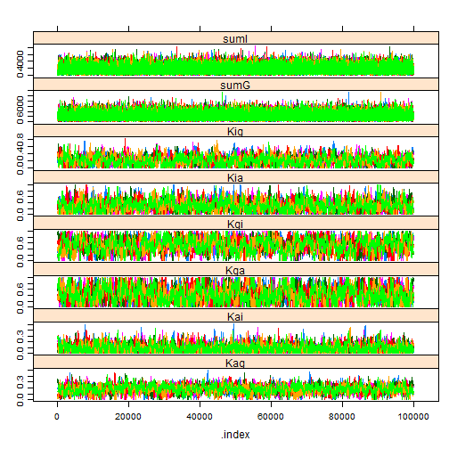
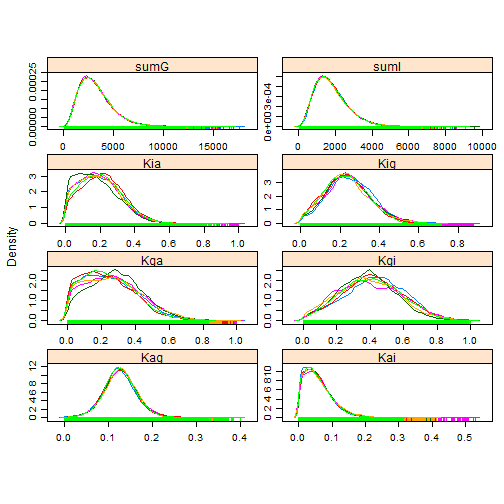
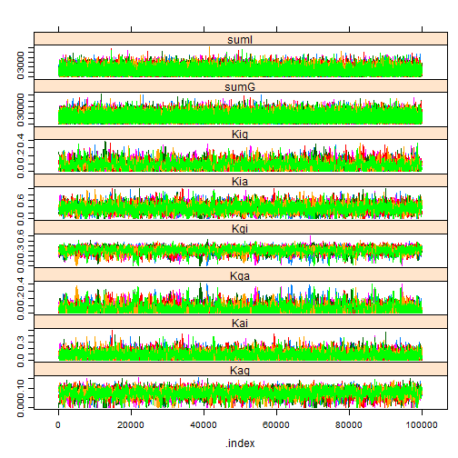
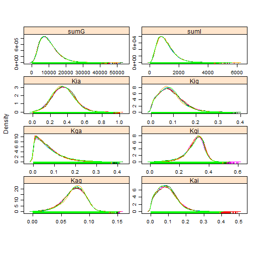

<!-- Specify the report's official name, goal & description. -->
# Diffusion results
**Report Goal**:  Provide a minimalistic report prototype for future reports.
**Report Description**: This is a prototype of a simple report.  It should represent the one side of the spectrum of MIECHV automated reports..

<!-- Point knitr to the underlying code file so it knows where to look for the chunks. -->


### Cohort: 1980

```r
cohortYear <- 1980
```


```r
require(rjags)
```

```
## Loading required package: rjags
```

```
## Loading required package: coda
```

```
## Loading required package: lattice
```

```
## linking to JAGS 3.3.0
```

```
## module basemod loaded
```

```
## module bugs loaded
```

```r


if (Sys.info()["nodename"] == "MICKEY") pathDirectory <- "F:/Users/wibeasley/Documents/Consulting/EmosaMcmc/Dev/EMOSA"
# pathDirectory <-
# 'F:/Users/wibeasley/Documents/Consulting/EmosaMcmc/Dev/EMOSA/OneShot_Only1984Diffusion'
if (Sys.info()["nodename"] == "MERKANEZ-PC") pathDirectory <- "F:/Users/wibeasley/Documents/SSuccess/InterimStudy"  #Change this directory location

# pathModel <- file.path(pathDirectory,
# 'DiffusionOnly/DiffusionGauss.bugs') pathModel <-
# file.path(pathDirectory, 'DiffusionOnly/DiffusionLogit.bugs')
pathModel <- file.path(pathDirectory, "DiffusionOnly/DiffusionBeta.bugs")
pathData <- file.path(pathDirectory, "Data/SummaryBirthYearByTime.csv")
# curve(dbeta(x, 1,1)) curve(dbeta(x, 10,10)) curve(dlogis(x, location =
# .25, scale = 1), xlim=c(-5, 5))


ds <- read.csv(pathData, stringsAsFactors = FALSE)
ds <- ds[ds$byear == cohortYear, ]  #Select only the desired cohort
ds <- ds[order(ds$time), ]  #Sort, just, to make sure values will be passed to JAGS in the correct order.

pg <- ds$ProportionGoers
pi <- ds$ProportionIrregulars
pa <- ds$ProportionAbsentees

# Proportion of Goers, of Irregulars, or Nongoers (or absentees) {Check
# these with data; I may have messed up the order} For the 1984 cohort pg
# <- c(0.401088929, 0.340290381, 0.249546279, 0.218693285, 0.180580762,
# 0.167876588, 0.157894737, 0.158802178, 0.161524501) pi <- c(0.233212341,
# 0.256805808, 0.288566243, 0.305807623, 0.27676951, 0.270417423,
# 0.229582577, 0.250453721, 0.237749546) pa <- c(0.36569873, 0.402903811,
# 0.461887477, 0.475499093, 0.542649728, 0.561705989, 0.612522686,
# 0.590744102, 0.600725953)
timeCount <- length(pg)
if (length(pi) != timeCount) stop("The proportions have a different number of time points.")
if (length(pa) != timeCount) stop("The proportions have a different number of time points.")
mean(c(pg, pi, pa))
```

```
## [1] 0.3333
```

```r

jagsData <- list(pg = pg, pi = pi, pa = pa, timeCount = timeCount)

# parameters <- c('mu')
parametersToTrack <- c("Kgi", "Kga", "Kig", "Kia", "Kag", "Kai", "sumG", "sumI")
# parametersToTrack <- c('Kgi', 'Kga', 'Kig', 'Kia', 'Kag', 'Kai', 'sumG',
# 'sumI', 'sumA') parametersToTrack <- c('Kgi', 'Kga', 'Kig', 'Kia',
# 'Kag', 'Kai', 'sigmaG', 'sigmaI') inits <- function(){
# list(Kgi=rnorm(1), Kga=rnorm(1), Kig=rnorm(1), Kia=rnorm(1),
# Kag=rnorm(1), Kai=rnorm(1)) }

countChains <- 6  #3 #6
countIterations <- 1e+05

startTime <- Sys.time()

jagsModel <- jags.model(file = pathModel, data = jagsData, n.chains = countChains)  #, inits=inits)
```

```
## Compiling model graph
##    Resolving undeclared variables
##    Allocating nodes
##    Graph Size: 183
## 
## Initializing model
```

```r
# print(jagsModel) update(jagsModel, 1000) #modifies the original object
# and returns NULL dic <- dic.samples(jagsModel, n.iter=countIterations)
# mcarray <- jags.samples(model=jagsModel, c('mu'),
# n.iter=countIterations) #If I understand correctly, the following line
# is similar, but better
chains <- coda.samples(jagsModel, variable.names = parametersToTrack, n.iter = countIterations)  # updates the model, and coerces the output to a single mcmc.list object.
elapsed <- Sys.time() - startTime
(condensed <- summary(chains))
```

```
## 
## Iterations = 1001:101000
## Thinning interval = 1 
## Number of chains = 6 
## Sample size per chain = 1e+05 
## 
## 1. Empirical mean and standard deviation for each variable,
##    plus standard error of the mean:
## 
##          Mean       SD Naive SE Time-series SE
## Kag  1.79e-01 6.39e-02 8.24e-05        0.00169
## Kai  9.16e-02 6.74e-02 8.70e-05        0.00166
## Kga  4.29e-01 2.46e-01 3.18e-04        0.00845
## Kgi  5.37e-01 2.18e-01 2.81e-04        0.00761
## Kia  3.08e-01 1.77e-01 2.29e-04        0.00576
## Kig  2.18e-01 1.19e-01 1.53e-04        0.00380
## sumG 2.07e+03 1.04e+03 1.34e+00        7.49938
## sumI 1.64e+03 8.30e+02 1.07e+00        7.21646
## 
## 2. Quantiles for each variable:
## 
##          2.5%      25%      50%      75%    97.5%
## Kag  5.49e-02    0.136 1.78e-01    0.220    0.309
## Kai  4.45e-03    0.040 7.86e-02    0.128    0.258
## Kga  2.98e-02    0.233 4.09e-01    0.611    0.923
## Kgi  9.54e-02    0.385 5.45e-01    0.698    0.931
## Kia  2.63e-02    0.174 2.93e-01    0.420    0.703
## Kig  2.06e-02    0.130 2.09e-01    0.294    0.478
## sumG 5.77e+02 1313.884 1.90e+03 2641.606 4547.114
## sumI 4.48e+02 1035.942 1.50e+03 2097.640 3635.838
```

```r

# windows() # dev.off()
gelman.diag(chains, autoburnin = FALSE)  #This is R-hat; the burnin period is manually specified above, so turn off the auto argument.
```

```
## Potential scale reduction factors:
## 
##      Point est. Upper C.I.
## Kag           1       1.01
## Kai           1       1.00
## Kga           1       1.01
## Kgi           1       1.00
## Kia           1       1.00
## Kig           1       1.00
## sumG          1       1.00
## sumI          1       1.00
## 
## Multivariate psrf
## 
## 1
```

```r
effectiveSize(chains)  #Sample size adjusted for autocorrelation
```

```
##     Kag     Kai     Kga     Kgi     Kia     Kig    sumG    sumI 
##  1473.1  2273.0  1160.1   996.5  1428.1  1242.3 41533.4 33645.1
```

```r

xyplot(chains)  #Needs at least two parameters; else throws an error.
```

 

```r
densityplot(chains)
```

 

```r
# gelman.plot(chains) print(rbind(paste('estimated mu: ',
# condensed$statistics['mu0', 'Mean']), paste('observed mean:', mean(y,
# na.rm=T))))
elapsed
```

```
## Time difference of 2.072 mins
```


### Cohort: 1981

```r
cohortYear <- 1981
```


```r
require(rjags)


if (Sys.info()["nodename"] == "MICKEY") pathDirectory <- "F:/Users/wibeasley/Documents/Consulting/EmosaMcmc/Dev/EMOSA"
# pathDirectory <-
# 'F:/Users/wibeasley/Documents/Consulting/EmosaMcmc/Dev/EMOSA/OneShot_Only1984Diffusion'
if (Sys.info()["nodename"] == "MERKANEZ-PC") pathDirectory <- "F:/Users/wibeasley/Documents/SSuccess/InterimStudy"  #Change this directory location

# pathModel <- file.path(pathDirectory,
# 'DiffusionOnly/DiffusionGauss.bugs') pathModel <-
# file.path(pathDirectory, 'DiffusionOnly/DiffusionLogit.bugs')
pathModel <- file.path(pathDirectory, "DiffusionOnly/DiffusionBeta.bugs")
pathData <- file.path(pathDirectory, "Data/SummaryBirthYearByTime.csv")
# curve(dbeta(x, 1,1)) curve(dbeta(x, 10,10)) curve(dlogis(x, location =
# .25, scale = 1), xlim=c(-5, 5))


ds <- read.csv(pathData, stringsAsFactors = FALSE)
ds <- ds[ds$byear == cohortYear, ]  #Select only the desired cohort
ds <- ds[order(ds$time), ]  #Sort, just, to make sure values will be passed to JAGS in the correct order.

pg <- ds$ProportionGoers
pi <- ds$ProportionIrregulars
pa <- ds$ProportionAbsentees

# Proportion of Goers, of Irregulars, or Nongoers (or absentees) {Check
# these with data; I may have messed up the order} For the 1984 cohort pg
# <- c(0.401088929, 0.340290381, 0.249546279, 0.218693285, 0.180580762,
# 0.167876588, 0.157894737, 0.158802178, 0.161524501) pi <- c(0.233212341,
# 0.256805808, 0.288566243, 0.305807623, 0.27676951, 0.270417423,
# 0.229582577, 0.250453721, 0.237749546) pa <- c(0.36569873, 0.402903811,
# 0.461887477, 0.475499093, 0.542649728, 0.561705989, 0.612522686,
# 0.590744102, 0.600725953)
timeCount <- length(pg)
if (length(pi) != timeCount) stop("The proportions have a different number of time points.")
if (length(pa) != timeCount) stop("The proportions have a different number of time points.")
mean(c(pg, pi, pa))
```

```
## [1] 0.3333
```

```r

jagsData <- list(pg = pg, pi = pi, pa = pa, timeCount = timeCount)

# parameters <- c('mu')
parametersToTrack <- c("Kgi", "Kga", "Kig", "Kia", "Kag", "Kai", "sumG", "sumI")
# parametersToTrack <- c('Kgi', 'Kga', 'Kig', 'Kia', 'Kag', 'Kai', 'sumG',
# 'sumI', 'sumA') parametersToTrack <- c('Kgi', 'Kga', 'Kig', 'Kia',
# 'Kag', 'Kai', 'sigmaG', 'sigmaI') inits <- function(){
# list(Kgi=rnorm(1), Kga=rnorm(1), Kig=rnorm(1), Kia=rnorm(1),
# Kag=rnorm(1), Kai=rnorm(1)) }

countChains <- 6  #3 #6
countIterations <- 1e+05

startTime <- Sys.time()

jagsModel <- jags.model(file = pathModel, data = jagsData, n.chains = countChains)  #, inits=inits)
```

```
## Compiling model graph
##    Resolving undeclared variables
##    Allocating nodes
##    Graph Size: 185
## 
## Initializing model
```

```r
# print(jagsModel) update(jagsModel, 1000) #modifies the original object
# and returns NULL dic <- dic.samples(jagsModel, n.iter=countIterations)
# mcarray <- jags.samples(model=jagsModel, c('mu'),
# n.iter=countIterations) #If I understand correctly, the following line
# is similar, but better
chains <- coda.samples(jagsModel, variable.names = parametersToTrack, n.iter = countIterations)  # updates the model, and coerces the output to a single mcmc.list object.
elapsed <- Sys.time() - startTime
(condensed <- summary(chains))
```

```
## 
## Iterations = 1001:101000
## Thinning interval = 1 
## Number of chains = 6 
## Sample size per chain = 1e+05 
## 
## 1. Empirical mean and standard deviation for each variable,
##    plus standard error of the mean:
## 
##          Mean       SD Naive SE Time-series SE
## Kag     0.128 3.72e-02 4.80e-05       6.11e-04
## Kai     0.059 4.29e-02 5.53e-05       7.01e-04
## Kga     0.266 1.61e-01 2.07e-04       5.02e-03
## Kgi     0.407 1.80e-01 2.32e-04       6.99e-03
## Kia     0.196 1.21e-01 1.56e-04       3.11e-03
## Kig     0.245 1.17e-01 1.51e-04       3.88e-03
## sumG 3235.586 1.64e+03 2.12e+00       1.06e+01
## sumI 1798.964 9.09e+02 1.17e+00       5.66e+00
## 
## 2. Quantiles for each variable:
## 
##          2.5%      25%      50%      75%    97.5%
## Kag  5.74e-02 1.04e-01 1.27e-01 1.51e-01    0.206
## Kai  3.04e-03 2.67e-02 5.12e-02 8.22e-02    0.162
## Kga  1.67e-02 1.39e-01 2.52e-01 3.74e-01    0.610
## Kgi  6.73e-02 2.81e-01 4.03e-01 5.27e-01    0.777
## Kia  1.16e-02 1.01e-01 1.86e-01 2.77e-01    0.456
## Kig  3.52e-02 1.63e-01 2.40e-01 3.19e-01    0.487
## sumG 8.75e+02 2.03e+03 2.96e+03 4.13e+03 7183.570
## sumI 4.84e+02 1.13e+03 1.65e+03 2.30e+03 3973.771
```

```r

# windows() # dev.off()
gelman.diag(chains, autoburnin = FALSE)  #This is R-hat; the burnin period is manually specified above, so turn off the auto argument.
```

```
## Potential scale reduction factors:
## 
##      Point est. Upper C.I.
## Kag        1.00       1.00
## Kai        1.00       1.00
## Kga        1.00       1.00
## Kgi        1.01       1.02
## Kia        1.00       1.00
## Kig        1.01       1.03
## sumG       1.00       1.00
## sumI       1.00       1.00
## 
## Multivariate psrf
## 
## 1.01
```

```r
effectiveSize(chains)  #Sample size adjusted for autocorrelation
```

```
##     Kag     Kai     Kga     Kgi     Kia     Kig    sumG    sumI 
##  3985.2  5644.1  1372.1   781.6  2191.1  1072.4 44257.9 45659.2
```

```r

xyplot(chains)  #Needs at least two parameters; else throws an error.
```

 

```r
densityplot(chains)
```

 

```r
# gelman.plot(chains) print(rbind(paste('estimated mu: ',
# condensed$statistics['mu0', 'Mean']), paste('observed mean:', mean(y,
# na.rm=T))))
elapsed
```

```
## Time difference of 1.995 mins
```


### Cohort: 1982

```r
cohortYear <- 1982
```


```r
require(rjags)


if (Sys.info()["nodename"] == "MICKEY") pathDirectory <- "F:/Users/wibeasley/Documents/Consulting/EmosaMcmc/Dev/EMOSA"
# pathDirectory <-
# 'F:/Users/wibeasley/Documents/Consulting/EmosaMcmc/Dev/EMOSA/OneShot_Only1984Diffusion'
if (Sys.info()["nodename"] == "MERKANEZ-PC") pathDirectory <- "F:/Users/wibeasley/Documents/SSuccess/InterimStudy"  #Change this directory location

# pathModel <- file.path(pathDirectory,
# 'DiffusionOnly/DiffusionGauss.bugs') pathModel <-
# file.path(pathDirectory, 'DiffusionOnly/DiffusionLogit.bugs')
pathModel <- file.path(pathDirectory, "DiffusionOnly/DiffusionBeta.bugs")
pathData <- file.path(pathDirectory, "Data/SummaryBirthYearByTime.csv")
# curve(dbeta(x, 1,1)) curve(dbeta(x, 10,10)) curve(dlogis(x, location =
# .25, scale = 1), xlim=c(-5, 5))


ds <- read.csv(pathData, stringsAsFactors = FALSE)
ds <- ds[ds$byear == cohortYear, ]  #Select only the desired cohort
ds <- ds[order(ds$time), ]  #Sort, just, to make sure values will be passed to JAGS in the correct order.

pg <- ds$ProportionGoers
pi <- ds$ProportionIrregulars
pa <- ds$ProportionAbsentees

# Proportion of Goers, of Irregulars, or Nongoers (or absentees) {Check
# these with data; I may have messed up the order} For the 1984 cohort pg
# <- c(0.401088929, 0.340290381, 0.249546279, 0.218693285, 0.180580762,
# 0.167876588, 0.157894737, 0.158802178, 0.161524501) pi <- c(0.233212341,
# 0.256805808, 0.288566243, 0.305807623, 0.27676951, 0.270417423,
# 0.229582577, 0.250453721, 0.237749546) pa <- c(0.36569873, 0.402903811,
# 0.461887477, 0.475499093, 0.542649728, 0.561705989, 0.612522686,
# 0.590744102, 0.600725953)
timeCount <- length(pg)
if (length(pi) != timeCount) stop("The proportions have a different number of time points.")
if (length(pa) != timeCount) stop("The proportions have a different number of time points.")
mean(c(pg, pi, pa))
```

```
## [1] 0.3333
```

```r

jagsData <- list(pg = pg, pi = pi, pa = pa, timeCount = timeCount)

# parameters <- c('mu')
parametersToTrack <- c("Kgi", "Kga", "Kig", "Kia", "Kag", "Kai", "sumG", "sumI")
# parametersToTrack <- c('Kgi', 'Kga', 'Kig', 'Kia', 'Kag', 'Kai', 'sumG',
# 'sumI', 'sumA') parametersToTrack <- c('Kgi', 'Kga', 'Kig', 'Kia',
# 'Kag', 'Kai', 'sigmaG', 'sigmaI') inits <- function(){
# list(Kgi=rnorm(1), Kga=rnorm(1), Kig=rnorm(1), Kia=rnorm(1),
# Kag=rnorm(1), Kai=rnorm(1)) }

countChains <- 6  #3 #6
countIterations <- 1e+05

startTime <- Sys.time()

jagsModel <- jags.model(file = pathModel, data = jagsData, n.chains = countChains)  #, inits=inits)
```

```
## Compiling model graph
##    Resolving undeclared variables
##    Allocating nodes
##    Graph Size: 185
## 
## Initializing model
```

```r
# print(jagsModel) update(jagsModel, 1000) #modifies the original object
# and returns NULL dic <- dic.samples(jagsModel, n.iter=countIterations)
# mcarray <- jags.samples(model=jagsModel, c('mu'),
# n.iter=countIterations) #If I understand correctly, the following line
# is similar, but better
chains <- coda.samples(jagsModel, variable.names = parametersToTrack, n.iter = countIterations)  # updates the model, and coerces the output to a single mcmc.list object.
elapsed <- Sys.time() - startTime
(condensed <- summary(chains))
```

```
## 
## Iterations = 1001:101000
## Thinning interval = 1 
## Number of chains = 6 
## Sample size per chain = 1e+05 
## 
## 1. Empirical mean and standard deviation for each variable,
##    plus standard error of the mean:
## 
##          Mean       SD Naive SE Time-series SE
## Kag  1.07e-01 5.75e-02 7.42e-05       0.001494
## Kai  5.55e-02 3.45e-02 4.45e-05       0.000515
## Kga  2.04e-01 1.39e-01 1.80e-04       0.002670
## Kgi  6.64e-01 1.34e-01 1.73e-04       0.003137
## Kia  2.26e-01 1.46e-01 1.88e-04       0.004716
## Kig  4.35e-01 1.69e-01 2.18e-04       0.006138
## sumG 7.19e+02 3.58e+02 4.62e-01       1.908941
## sumI 2.71e+03 1.39e+03 1.79e+00       7.723542
## 
## 2. Quantiles for each variable:
## 
##          2.5%      25%      50%      75%    97.5%
## Kag  1.22e-02 6.55e-02 1.02e-01 1.43e-01    0.235
## Kai  4.22e-03 2.99e-02 5.13e-02 7.55e-02    0.134
## Kga  9.86e-03 9.31e-02 1.84e-01 2.91e-01    0.520
## Kgi  3.84e-01 5.79e-01 6.68e-01 7.55e-01    0.918
## Kia  1.21e-02 1.09e-01 2.10e-01 3.22e-01    0.542
## Kig  9.14e-02 3.19e-01 4.42e-01 5.55e-01    0.750
## sumG 1.98e+02 4.57e+02 6.60e+02 9.18e+02 1571.299
## sumI 7.04e+02 1.69e+03 2.48e+03 3.47e+03 6032.638
```

```r

# windows() # dev.off()
gelman.diag(chains, autoburnin = FALSE)  #This is R-hat; the burnin period is manually specified above, so turn off the auto argument.
```

```
## Potential scale reduction factors:
## 
##      Point est. Upper C.I.
## Kag        1.00       1.01
## Kai        1.00       1.00
## Kga        1.00       1.00
## Kgi        1.00       1.01
## Kia        1.00       1.01
## Kig        1.01       1.02
## sumG       1.00       1.00
## sumI       1.00       1.00
## 
## Multivariate psrf
## 
## 1.01
```

```r
effectiveSize(chains)  #Sample size adjusted for autocorrelation
```

```
##     Kag     Kai     Kga     Kgi     Kia     Kig    sumG    sumI 
##  3500.6  6193.9  5067.4  2217.5  1460.6   869.7 70581.7 44073.5
```

```r

xyplot(chains)  #Needs at least two parameters; else throws an error.
```

 

```r
densityplot(chains)
```

 

```r
# gelman.plot(chains) print(rbind(paste('estimated mu: ',
# condensed$statistics['mu0', 'Mean']), paste('observed mean:', mean(y,
# na.rm=T))))
elapsed
```

```
## Time difference of 2.056 mins
```


### Cohort: 1983

```r
cohortYear <- 1983
```


```r
require(rjags)


if (Sys.info()["nodename"] == "MICKEY") pathDirectory <- "F:/Users/wibeasley/Documents/Consulting/EmosaMcmc/Dev/EMOSA"
# pathDirectory <-
# 'F:/Users/wibeasley/Documents/Consulting/EmosaMcmc/Dev/EMOSA/OneShot_Only1984Diffusion'
if (Sys.info()["nodename"] == "MERKANEZ-PC") pathDirectory <- "F:/Users/wibeasley/Documents/SSuccess/InterimStudy"  #Change this directory location

# pathModel <- file.path(pathDirectory,
# 'DiffusionOnly/DiffusionGauss.bugs') pathModel <-
# file.path(pathDirectory, 'DiffusionOnly/DiffusionLogit.bugs')
pathModel <- file.path(pathDirectory, "DiffusionOnly/DiffusionBeta.bugs")
pathData <- file.path(pathDirectory, "Data/SummaryBirthYearByTime.csv")
# curve(dbeta(x, 1,1)) curve(dbeta(x, 10,10)) curve(dlogis(x, location =
# .25, scale = 1), xlim=c(-5, 5))


ds <- read.csv(pathData, stringsAsFactors = FALSE)
ds <- ds[ds$byear == cohortYear, ]  #Select only the desired cohort
ds <- ds[order(ds$time), ]  #Sort, just, to make sure values will be passed to JAGS in the correct order.

pg <- ds$ProportionGoers
pi <- ds$ProportionIrregulars
pa <- ds$ProportionAbsentees

# Proportion of Goers, of Irregulars, or Nongoers (or absentees) {Check
# these with data; I may have messed up the order} For the 1984 cohort pg
# <- c(0.401088929, 0.340290381, 0.249546279, 0.218693285, 0.180580762,
# 0.167876588, 0.157894737, 0.158802178, 0.161524501) pi <- c(0.233212341,
# 0.256805808, 0.288566243, 0.305807623, 0.27676951, 0.270417423,
# 0.229582577, 0.250453721, 0.237749546) pa <- c(0.36569873, 0.402903811,
# 0.461887477, 0.475499093, 0.542649728, 0.561705989, 0.612522686,
# 0.590744102, 0.600725953)
timeCount <- length(pg)
if (length(pi) != timeCount) stop("The proportions have a different number of time points.")
if (length(pa) != timeCount) stop("The proportions have a different number of time points.")
mean(c(pg, pi, pa))
```

```
## [1] 0.3333
```

```r

jagsData <- list(pg = pg, pi = pi, pa = pa, timeCount = timeCount)

# parameters <- c('mu')
parametersToTrack <- c("Kgi", "Kga", "Kig", "Kia", "Kag", "Kai", "sumG", "sumI")
# parametersToTrack <- c('Kgi', 'Kga', 'Kig', 'Kia', 'Kag', 'Kai', 'sumG',
# 'sumI', 'sumA') parametersToTrack <- c('Kgi', 'Kga', 'Kig', 'Kia',
# 'Kag', 'Kai', 'sigmaG', 'sigmaI') inits <- function(){
# list(Kgi=rnorm(1), Kga=rnorm(1), Kig=rnorm(1), Kia=rnorm(1),
# Kag=rnorm(1), Kai=rnorm(1)) }

countChains <- 6  #3 #6
countIterations <- 1e+05

startTime <- Sys.time()

jagsModel <- jags.model(file = pathModel, data = jagsData, n.chains = countChains)  #, inits=inits)
```

```
## Compiling model graph
##    Resolving undeclared variables
##    Allocating nodes
##    Graph Size: 183
## 
## Initializing model
```

```r
# print(jagsModel) update(jagsModel, 1000) #modifies the original object
# and returns NULL dic <- dic.samples(jagsModel, n.iter=countIterations)
# mcarray <- jags.samples(model=jagsModel, c('mu'),
# n.iter=countIterations) #If I understand correctly, the following line
# is similar, but better
chains <- coda.samples(jagsModel, variable.names = parametersToTrack, n.iter = countIterations)  # updates the model, and coerces the output to a single mcmc.list object.
elapsed <- Sys.time() - startTime
(condensed <- summary(chains))
```

```
## 
## Iterations = 1001:101000
## Thinning interval = 1 
## Number of chains = 6 
## Sample size per chain = 1e+05 
## 
## 1. Empirical mean and standard deviation for each variable,
##    plus standard error of the mean:
## 
##          Mean       SD Naive SE Time-series SE
## Kag  7.33e-02 1.95e-02 2.52e-05       3.96e-04
## Kai  9.18e-02 5.54e-02 7.15e-05       8.45e-04
## Kga  6.63e-02 5.51e-02 7.12e-05       1.35e-03
## Kgi  3.08e-01 5.93e-02 7.66e-05       1.49e-03
## Kia  3.55e-01 1.28e-01 1.66e-04       2.46e-03
## Kig  8.70e-02 5.24e-02 6.77e-05       1.14e-03
## sumG 9.84e+03 5.25e+03 6.78e+00       3.49e+01
## sumI 1.09e+03 5.62e+02 7.25e-01       4.22e+00
## 
## 2. Quantiles for each variable:
## 
##          2.5%      25%      50%      75%    97.5%
## Kag  2.95e-02 6.15e-02 7.50e-02 8.70e-02 1.07e-01
## Kai  7.15e-03 5.05e-02 8.56e-02 1.25e-01 2.17e-01
## Kga  2.20e-03 2.39e-02 5.28e-02 9.49e-02 2.05e-01
## Kgi  1.69e-01 2.76e-01 3.17e-01 3.48e-01 4.03e-01
## Kia  1.22e-01 2.66e-01 3.48e-01 4.36e-01 6.26e-01
## Kig  7.20e-03 4.80e-02 8.08e-02 1.18e-01 2.09e-01
## sumG 2.41e+03 5.99e+03 8.92e+03 1.27e+04 2.25e+04
## sumI 2.89e+02 6.81e+02 9.97e+02 1.40e+03 2.44e+03
```

```r

# windows() # dev.off()
gelman.diag(chains, autoburnin = FALSE)  #This is R-hat; the burnin period is manually specified above, so turn off the auto argument.
```

```
## Potential scale reduction factors:
## 
##      Point est. Upper C.I.
## Kag           1          1
## Kai           1          1
## Kga           1          1
## Kgi           1          1
## Kia           1          1
## Kig           1          1
## sumG          1          1
## sumI          1          1
## 
## Multivariate psrf
## 
## 1
```

```r
effectiveSize(chains)  #Sample size adjusted for autocorrelation
```

```
##   Kag   Kai   Kga   Kgi   Kia   Kig  sumG  sumI 
##  3370  5331  2443  2571  3982  2572 40839 35827
```

```r

xyplot(chains)  #Needs at least two parameters; else throws an error.
```

 

```r
densityplot(chains)
```

 

```r
# gelman.plot(chains) print(rbind(paste('estimated mu: ',
# condensed$statistics['mu0', 'Mean']), paste('observed mean:', mean(y,
# na.rm=T))))
elapsed
```

```
## Time difference of 1.96 mins
```


### Cohort: 1984

```r
cohortYear <- 1984
```


```r
require(rjags)


if (Sys.info()["nodename"] == "MICKEY") pathDirectory <- "F:/Users/wibeasley/Documents/Consulting/EmosaMcmc/Dev/EMOSA"
# pathDirectory <-
# 'F:/Users/wibeasley/Documents/Consulting/EmosaMcmc/Dev/EMOSA/OneShot_Only1984Diffusion'
if (Sys.info()["nodename"] == "MERKANEZ-PC") pathDirectory <- "F:/Users/wibeasley/Documents/SSuccess/InterimStudy"  #Change this directory location

# pathModel <- file.path(pathDirectory,
# 'DiffusionOnly/DiffusionGauss.bugs') pathModel <-
# file.path(pathDirectory, 'DiffusionOnly/DiffusionLogit.bugs')
pathModel <- file.path(pathDirectory, "DiffusionOnly/DiffusionBeta.bugs")
pathData <- file.path(pathDirectory, "Data/SummaryBirthYearByTime.csv")
# curve(dbeta(x, 1,1)) curve(dbeta(x, 10,10)) curve(dlogis(x, location =
# .25, scale = 1), xlim=c(-5, 5))


ds <- read.csv(pathData, stringsAsFactors = FALSE)
ds <- ds[ds$byear == cohortYear, ]  #Select only the desired cohort
ds <- ds[order(ds$time), ]  #Sort, just, to make sure values will be passed to JAGS in the correct order.

pg <- ds$ProportionGoers
pi <- ds$ProportionIrregulars
pa <- ds$ProportionAbsentees

# Proportion of Goers, of Irregulars, or Nongoers (or absentees) {Check
# these with data; I may have messed up the order} For the 1984 cohort pg
# <- c(0.401088929, 0.340290381, 0.249546279, 0.218693285, 0.180580762,
# 0.167876588, 0.157894737, 0.158802178, 0.161524501) pi <- c(0.233212341,
# 0.256805808, 0.288566243, 0.305807623, 0.27676951, 0.270417423,
# 0.229582577, 0.250453721, 0.237749546) pa <- c(0.36569873, 0.402903811,
# 0.461887477, 0.475499093, 0.542649728, 0.561705989, 0.612522686,
# 0.590744102, 0.600725953)
timeCount <- length(pg)
if (length(pi) != timeCount) stop("The proportions have a different number of time points.")
if (length(pa) != timeCount) stop("The proportions have a different number of time points.")
mean(c(pg, pi, pa))
```

```
## [1] 0.3333
```

```r

jagsData <- list(pg = pg, pi = pi, pa = pa, timeCount = timeCount)

# parameters <- c('mu')
parametersToTrack <- c("Kgi", "Kga", "Kig", "Kia", "Kag", "Kai", "sumG", "sumI")
# parametersToTrack <- c('Kgi', 'Kga', 'Kig', 'Kia', 'Kag', 'Kai', 'sumG',
# 'sumI', 'sumA') parametersToTrack <- c('Kgi', 'Kga', 'Kig', 'Kia',
# 'Kag', 'Kai', 'sigmaG', 'sigmaI') inits <- function(){
# list(Kgi=rnorm(1), Kga=rnorm(1), Kig=rnorm(1), Kia=rnorm(1),
# Kag=rnorm(1), Kai=rnorm(1)) }

countChains <- 6  #3 #6
countIterations <- 1e+05

startTime <- Sys.time()

jagsModel <- jags.model(file = pathModel, data = jagsData, n.chains = countChains)  #, inits=inits)
```

```
## Compiling model graph
##    Resolving undeclared variables
##    Allocating nodes
##    Graph Size: 185
## 
## Initializing model
```

```r
# print(jagsModel) update(jagsModel, 1000) #modifies the original object
# and returns NULL dic <- dic.samples(jagsModel, n.iter=countIterations)
# mcarray <- jags.samples(model=jagsModel, c('mu'),
# n.iter=countIterations) #If I understand correctly, the following line
# is similar, but better
chains <- coda.samples(jagsModel, variable.names = parametersToTrack, n.iter = countIterations)  # updates the model, and coerces the output to a single mcmc.list object.
elapsed <- Sys.time() - startTime
(condensed <- summary(chains))
```

```
## 
## Iterations = 1001:101000
## Thinning interval = 1 
## Number of chains = 6 
## Sample size per chain = 1e+05 
## 
## 1. Empirical mean and standard deviation for each variable,
##    plus standard error of the mean:
## 
##          Mean       SD Naive SE Time-series SE
## Kag    0.0504   0.0242 3.12e-05       0.000170
## Kai    0.0916   0.0593 7.65e-05       0.000711
## Kga    0.0982   0.0664 8.57e-05       0.000605
## Kgi    0.2124   0.0622 8.03e-05       0.000597
## Kia    0.2934   0.1422 1.84e-04       0.001818
## Kig    0.0662   0.0533 6.89e-05       0.000489
## sumG 965.1307 504.2468 6.51e-01       1.783286
## sumI 647.2846 326.8404 4.22e-01       1.155877
## 
## 2. Quantiles for each variable:
## 
##          2.5%      25%      50%      75%    97.5%
## Kag  5.38e-03   0.0332   0.0508 6.68e-02 9.79e-02
## Kai  6.16e-03   0.0468   0.0835 1.26e-01 2.28e-01
## Kga  5.08e-03   0.0456   0.0882 1.39e-01 2.50e-01
## Kgi  7.89e-02   0.1732   0.2161 2.55e-01 3.26e-01
## Kia  5.13e-02   0.1903   0.2825 3.83e-01 6.02e-01
## Kig  2.15e-03   0.0236   0.0537 9.69e-02 1.95e-01
## sumG 2.49e+02 597.2285 876.7238 1.24e+03 2.18e+03
## sumI 1.75e+02 407.9425 592.9738 8.27e+02 1.43e+03
```

```r

# windows() # dev.off()
gelman.diag(chains, autoburnin = FALSE)  #This is R-hat; the burnin period is manually specified above, so turn off the auto argument.
```

```
## Potential scale reduction factors:
## 
##      Point est. Upper C.I.
## Kag           1          1
## Kai           1          1
## Kga           1          1
## Kgi           1          1
## Kia           1          1
## Kig           1          1
## sumG          1          1
## sumI          1          1
## 
## Multivariate psrf
## 
## 1
```

```r
effectiveSize(chains)  #Sample size adjusted for autocorrelation
```

```
##   Kag   Kai   Kga   Kgi   Kia   Kig  sumG  sumI 
## 20992  7284 12792 11570  5747 12418 90443 97385
```

```r

xyplot(chains)  #Needs at least two parameters; else throws an error.
```

 

```r
densityplot(chains)
```

 

```r
# gelman.plot(chains) print(rbind(paste('estimated mu: ',
# condensed$statistics['mu0', 'Mean']), paste('observed mean:', mean(y,
# na.rm=T))))
elapsed
```

```
## Time difference of 2.103 mins
```

