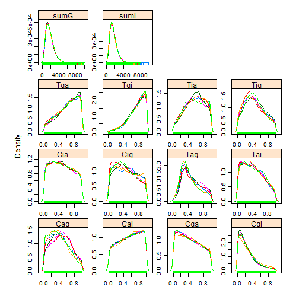
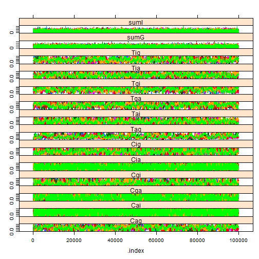
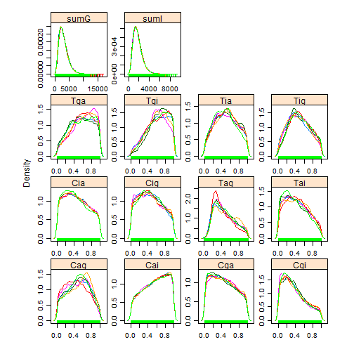
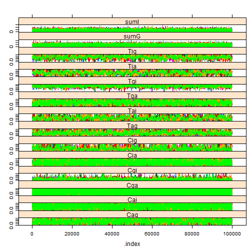
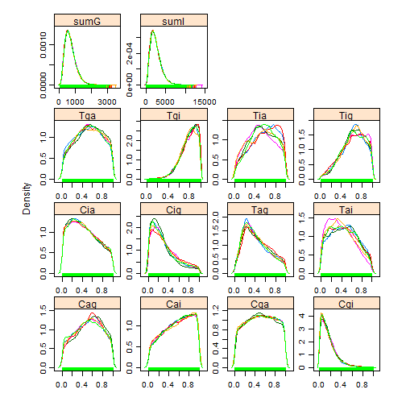
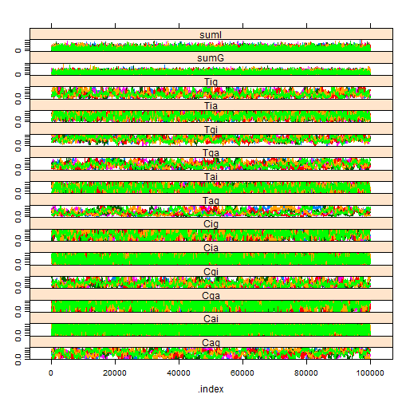
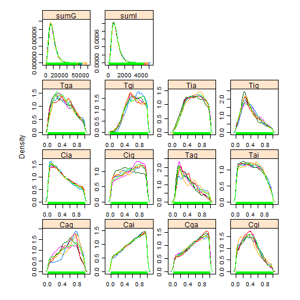
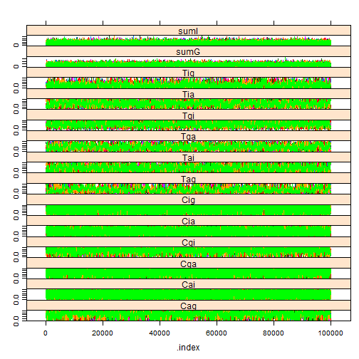
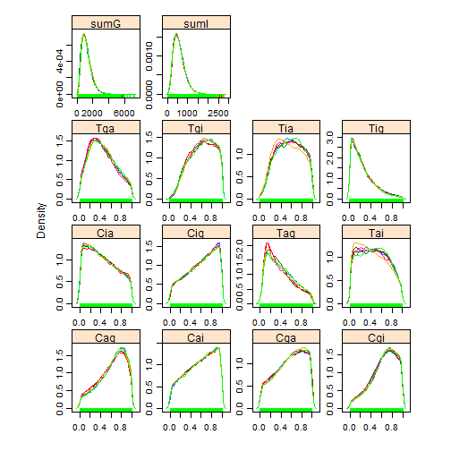

<!-- Specify the report's official name, goal & description. -->
# Hybrid results
**Report Goal**:  Provide a minimalistic report prototype for future reports.
**Report Description**: This is a prototype of a simple report.  It should represent the one side of the spectrum of MIECHV automated reports..

<!-- Point knitr to the underlying code file so it knows where to look for the chunks. -->


### Cohort: 1980
Andrey -write something here.

```r
cohortYear <- 1980
```


```r
require(rjags)
```

```
## Loading required package: rjags
```

```
## Loading required package: coda
```

```
## Loading required package: lattice
```

```
## linking to JAGS 3.3.0
```

```
## module basemod loaded
```

```
## module bugs loaded
```

```r
# require(coda)
rjags::load.module("dic")  # load a few useful modules (JAGS is modular in design): https://sites.google.com/site/autocatalysis/bayesian-methods-using-jags
```

```
## module dic loaded
```

```r


if (Sys.info()["nodename"] == "MICKEY") pathDirectory <- "F:/Users/wibeasley/Documents/Consulting/EmosaMcmc/Dev/EMOSA"
# pathDirectory <-
# 'F:/Users/wibeasley/Documents/Consulting/EmosaMcmc/Dev/EMOSA/OneShot_Only1984Diffusion'
if (Sys.info()["nodename"] == "MERKANEZ-PC") pathDirectory <- "F:/Users/wibeasley/Documents/SSuccess/InterimStudy"  #Change this directory location

pathModel <- file.path(pathDirectory, "HybridOnly/HybridBeta.bugs")
pathData <- file.path(pathDirectory, "Data/SummaryBirthYearByTime.csv")
pathOutChains <- file.path(pathDirectory, paste0("Data/ChainsHybrid", cohortYear, 
    ".csv"))

# curve(dbeta(x, 1,1)) curve(dbeta(x, 10,10)) curve(dlogis(x, location =
# .25, scale = 1), xlim=c(-5, 5))


ds <- read.csv(pathData, stringsAsFactors = FALSE)
ds <- ds[ds$byear == cohortYear, ]  #Select only the desired cohort
ds <- ds[order(ds$time), ]  #Sort, just, to make sure values will be passed to JAGS in the correct order.

pg <- ds$ProportionGoers
pi <- ds$ProportionIrregulars
pa <- ds$ProportionAbsentees

# Proportion of Goers, of Irregulars, or Nongoers (or absentees) {Check
# these with data; I may have messed up the order} For the 1984 cohort pg
# <- c(0.401088929, 0.340290381, 0.249546279, 0.218693285, 0.180580762,
# 0.167876588, 0.157894737, 0.158802178, 0.161524501) pi <- c(0.233212341,
# 0.256805808, 0.288566243, 0.305807623, 0.27676951, 0.270417423,
# 0.229582577, 0.250453721, 0.237749546) pa <- c(0.36569873, 0.402903811,
# 0.461887477, 0.475499093, 0.542649728, 0.561705989, 0.612522686,
# 0.590744102, 0.600725953)
timeCount <- length(pg)
if (length(pi) != timeCount) stop("The proportions have a different number of time points.")
if (length(pa) != timeCount) stop("The proportions have a different number of time points.")
mean(c(pg, pi, pa))
```

```
## [1] 0.3333
```

```r

jagsData <- list(pg = pg, pi = pi, pa = pa, timeCount = timeCount)


parametersToTrack <- c("Tgi", "Tga", "Tig", "Tia", "Tag", "Tai", "Cgi", "Cga", 
    "Cig", "Cia", "Cag", "Cai", "sumG", "sumI")  #For Beta
# parametersToTrack <- c('Tgi', 'Tga', 'Tig', 'Tia', 'Tag', 'Tai',
# 'sigmaG', 'sigmaI') #For Gauss
parametersToTrackWithDic <- c("pD", "deviance", parametersToTrack)
# inits <- function(){ list(Kgi=rnorm(1), Kga=rnorm(1), Kig=rnorm(1),
# Kia=rnorm(1), Kag=rnorm(1), Kai=rnorm(1)) }

countChains <- 6  #3 #6
countIterations <- 1e+05

startTime <- Sys.time()

jagsModel <- jags.model(file = pathModel, data = jagsData, n.chains = countChains)  #, inits=inits)
```

```
## Compiling model graph
##    Resolving undeclared variables
##    Allocating nodes
##    Graph Size: 236
## 
## Initializing model
```

```r
# print(jagsModel) update(jagsModel, 1000) #modifies the original object
# and returns NULL
dic <- dic.samples(jagsModel, n.iter = countIterations)
dic
```

```
## Mean deviance:  -96.5 
## penalty 7.1 
## Penalized deviance: -89.4
```

```r
# mcarray <- jags.samples(model=jagsModel,
# variable.names=parametersToTrackWithDic, n.iter=countIterations ) #If I
# understand correctly, the following line is similar, but better
# as.mcmc.list(mcarray$Cag) mcarray <- mcmc(mcarray) mcarray <-
# mcmc.list(mcarray) nchain(mcarray) str(mcarray) class(mcarray)
# summary(mcarray)

chains <- coda.samples(jagsModel, variable.names = parametersToTrack, n.iter = countIterations)  # updates the model, and coerces the output to a single mcmc.list object.
# class(chains)
elapsed <- Sys.time() - startTime
(condensed <- summary(chains))
```

```
## 
## Iterations = 101001:201000
## Thinning interval = 1 
## Number of chains = 6 
## Sample size per chain = 1e+05 
## 
## 1. Empirical mean and standard deviation for each variable,
##    plus standard error of the mean:
## 
##          Mean      SD Naive SE Time-series SE
## Cag     0.426   0.252 0.000325        0.00862
## Cai     0.548   0.282 0.000364        0.00230
## Cga     0.442   0.281 0.000363        0.00290
## Cgi     0.269   0.224 0.000289        0.00504
## Cia     0.470   0.280 0.000361        0.00298
## Cig     0.457   0.278 0.000359        0.00675
## Tag     0.461   0.232 0.000299        0.00924
## Tai     0.415   0.261 0.000337        0.00761
## Tga     0.622   0.259 0.000335        0.00645
## Tgi     0.732   0.205 0.000265        0.00454
## Tia     0.569   0.250 0.000323        0.00749
## Tig     0.444   0.249 0.000321        0.00660
## sumG 1826.902 958.880 1.237909        8.23038
## sumI 1631.300 809.942 1.045630        5.51418
## 
## 2. Quantiles for each variable:
## 
##          2.5%      25%      50%      75%    97.5%
## Cag  2.42e-02 2.21e-01    0.410    0.613    0.931
## Cai  3.64e-02 3.16e-01    0.570    0.792    0.980
## Cga  1.91e-02 1.99e-01    0.415    0.671    0.962
## Cgi  9.24e-03 9.56e-02    0.208    0.382    0.855
## Cia  2.47e-02 2.32e-01    0.455    0.702    0.967
## Cig  2.33e-02 2.20e-01    0.437    0.682    0.965
## Tag  1.03e-01 2.79e-01    0.416    0.626    0.946
## Tai  2.13e-02 1.94e-01    0.389    0.614    0.934
## Tga  7.48e-02 4.35e-01    0.664    0.841    0.984
## Tgi  2.28e-01 6.10e-01    0.776    0.896    0.990
## Tia  8.12e-02 3.80e-01    0.580    0.775    0.974
## Tig  3.78e-02 2.48e-01    0.418    0.625    0.945
## sumG 4.88e+02 1.13e+03 1649.921 2339.130 4167.077
## sumI 4.67e+02 1.04e+03 1493.167 2071.766 3579.115
```

```r
# head(chains, 20)

# windows() # dev.off()
gelman.diag(chains, autoburnin = FALSE)  #This is R-hat; the burnin period is manually specified above, so turn off the auto argument.
```

```
## Potential scale reduction factors:
## 
##      Point est. Upper C.I.
## Cag        1.01       1.02
## Cai        1.00       1.00
## Cga        1.00       1.00
## Cgi        1.00       1.01
## Cia        1.00       1.00
## Cig        1.00       1.01
## Tag        1.01       1.03
## Tai        1.00       1.00
## Tga        1.00       1.00
## Tgi        1.00       1.00
## Tia        1.00       1.00
## Tig        1.00       1.01
## sumG       1.00       1.00
## sumI       1.00       1.00
## 
## Multivariate psrf
## 
## 1.01
```

```r
effectiveSize(chains)  #Sample size adjusted for autocorrelation
```

```
##   Cag   Cai   Cga   Cgi   Cia   Cig   Tag   Tai   Tga   Tgi   Tia   Tig 
##  1226 16170 11332  2501  9420  2232   829  1426  1992  2287  1441  1745 
##  sumG  sumI 
## 23524 47727
```

```r

xyplot(chains)  #Needs at least two parameters; else throws an error.
```

 

```r
densityplot(chains)
```

 

```r
# gelman.plot(chains) print(rbind(paste('estimated mu: ',
# condensed$statistics['mu0', 'Mean']), paste('observed mean:', mean(y,
# na.rm=T)))) dsChains <- as.data.frame(chains) write.csv(chains,
# pathOutChains, row.names=FALSE)
elapsed
```

```
## Time difference of 14.42 mins
```

```r


# Coda & DIC on JAGS:
# http://sourceforge.net/p/mcmc-jags/discussion/610037/thread/ea46dc43
```


### Cohort: 1981

```r
cohortYear <- 1981
```


```r
require(rjags)
# require(coda)
rjags::load.module("dic")  # load a few useful modules (JAGS is modular in design): https://sites.google.com/site/autocatalysis/bayesian-methods-using-jags


if (Sys.info()["nodename"] == "MICKEY") pathDirectory <- "F:/Users/wibeasley/Documents/Consulting/EmosaMcmc/Dev/EMOSA"
# pathDirectory <-
# 'F:/Users/wibeasley/Documents/Consulting/EmosaMcmc/Dev/EMOSA/OneShot_Only1984Diffusion'
if (Sys.info()["nodename"] == "MERKANEZ-PC") pathDirectory <- "F:/Users/wibeasley/Documents/SSuccess/InterimStudy"  #Change this directory location

pathModel <- file.path(pathDirectory, "HybridOnly/HybridBeta.bugs")
pathData <- file.path(pathDirectory, "Data/SummaryBirthYearByTime.csv")
pathOutChains <- file.path(pathDirectory, paste0("Data/ChainsHybrid", cohortYear, 
    ".csv"))

# curve(dbeta(x, 1,1)) curve(dbeta(x, 10,10)) curve(dlogis(x, location =
# .25, scale = 1), xlim=c(-5, 5))


ds <- read.csv(pathData, stringsAsFactors = FALSE)
ds <- ds[ds$byear == cohortYear, ]  #Select only the desired cohort
ds <- ds[order(ds$time), ]  #Sort, just, to make sure values will be passed to JAGS in the correct order.

pg <- ds$ProportionGoers
pi <- ds$ProportionIrregulars
pa <- ds$ProportionAbsentees

# Proportion of Goers, of Irregulars, or Nongoers (or absentees) {Check
# these with data; I may have messed up the order} For the 1984 cohort pg
# <- c(0.401088929, 0.340290381, 0.249546279, 0.218693285, 0.180580762,
# 0.167876588, 0.157894737, 0.158802178, 0.161524501) pi <- c(0.233212341,
# 0.256805808, 0.288566243, 0.305807623, 0.27676951, 0.270417423,
# 0.229582577, 0.250453721, 0.237749546) pa <- c(0.36569873, 0.402903811,
# 0.461887477, 0.475499093, 0.542649728, 0.561705989, 0.612522686,
# 0.590744102, 0.600725953)
timeCount <- length(pg)
if (length(pi) != timeCount) stop("The proportions have a different number of time points.")
if (length(pa) != timeCount) stop("The proportions have a different number of time points.")
mean(c(pg, pi, pa))
```

```
## [1] 0.3333
```

```r

jagsData <- list(pg = pg, pi = pi, pa = pa, timeCount = timeCount)


parametersToTrack <- c("Tgi", "Tga", "Tig", "Tia", "Tag", "Tai", "Cgi", "Cga", 
    "Cig", "Cia", "Cag", "Cai", "sumG", "sumI")  #For Beta
# parametersToTrack <- c('Tgi', 'Tga', 'Tig', 'Tia', 'Tag', 'Tai',
# 'sigmaG', 'sigmaI') #For Gauss
parametersToTrackWithDic <- c("pD", "deviance", parametersToTrack)
# inits <- function(){ list(Kgi=rnorm(1), Kga=rnorm(1), Kig=rnorm(1),
# Kia=rnorm(1), Kag=rnorm(1), Kai=rnorm(1)) }

countChains <- 6  #3 #6
countIterations <- 1e+05

startTime <- Sys.time()

jagsModel <- jags.model(file = pathModel, data = jagsData, n.chains = countChains)  #, inits=inits)
```

```
## Compiling model graph
##    Resolving undeclared variables
##    Allocating nodes
##    Graph Size: 239
## 
## Initializing model
```

```r
# print(jagsModel) update(jagsModel, 1000) #modifies the original object
# and returns NULL
dic <- dic.samples(jagsModel, n.iter = countIterations)
dic
```

```
## Mean deviance:  -100 
## penalty 7.59 
## Penalized deviance: -92.5
```

```r
# mcarray <- jags.samples(model=jagsModel,
# variable.names=parametersToTrackWithDic, n.iter=countIterations ) #If I
# understand correctly, the following line is similar, but better
# as.mcmc.list(mcarray$Cag) mcarray <- mcmc(mcarray) mcarray <-
# mcmc.list(mcarray) nchain(mcarray) str(mcarray) class(mcarray)
# summary(mcarray)

chains <- coda.samples(jagsModel, variable.names = parametersToTrack, n.iter = countIterations)  # updates the model, and coerces the output to a single mcmc.list object.
# class(chains)
elapsed <- Sys.time() - startTime
(condensed <- summary(chains))
```

```
## 
## Iterations = 101001:201000
## Thinning interval = 1 
## Number of chains = 6 
## Sample size per chain = 1e+05 
## 
## 1. Empirical mean and standard deviation for each variable,
##    plus standard error of the mean:
## 
##          Mean       SD Naive SE Time-series SE
## Cag     0.489    0.255 0.000330        0.00986
## Cai     0.565    0.276 0.000357        0.00247
## Cga     0.449    0.277 0.000357        0.00463
## Cgi     0.375    0.259 0.000335        0.00755
## Cia     0.453    0.274 0.000354        0.00323
## Cig     0.460    0.270 0.000349        0.00780
## Tag     0.459    0.232 0.000299        0.01055
## Tai     0.423    0.260 0.000336        0.00793
## Tga     0.577    0.258 0.000333        0.00883
## Tgi     0.620    0.237 0.000306        0.00820
## Tia     0.504    0.253 0.000327        0.00815
## Tig     0.486    0.243 0.000314        0.00816
## sumG 2994.344 1562.529 2.017217       11.86167
## sumI 1755.394  858.966 1.108920        5.35132
## 
## 2. Quantiles for each variable:
## 
##          2.5%      25%      50%      75%    97.5%
## Cag    0.0348    0.284    0.499    0.691    0.943
## Cai    0.0445    0.344    0.591    0.803    0.980
## Cga    0.0223    0.212    0.428    0.671    0.961
## Cgi    0.0170    0.163    0.326    0.551    0.937
## Cia    0.0243    0.223    0.430    0.672    0.962
## Cig    0.0245    0.235    0.443    0.674    0.959
## Tag    0.1160    0.269    0.420    0.626    0.943
## Tai    0.0228    0.205    0.400    0.623    0.934
## Tga    0.0677    0.381    0.596    0.794    0.978
## Tgi    0.1162    0.453    0.643    0.814    0.980
## Tia    0.0541    0.303    0.500    0.702    0.960
## Tig    0.0577    0.299    0.471    0.669    0.951
## sumG 795.4758 1850.419 2711.019 3839.619 6783.484
## sumI 509.1604 1129.148 1612.333 2226.190 3810.309
```

```r
# head(chains, 20)

# windows() # dev.off()
gelman.diag(chains, autoburnin = FALSE)  #This is R-hat; the burnin period is manually specified above, so turn off the auto argument.
```

```
## Potential scale reduction factors:
## 
##      Point est. Upper C.I.
## Cag        1.01       1.02
## Cai        1.00       1.00
## Cga        1.00       1.00
## Cgi        1.00       1.00
## Cia        1.00       1.00
## Cig        1.00       1.00
## Tag        1.01       1.02
## Tai        1.00       1.01
## Tga        1.00       1.01
## Tgi        1.01       1.01
## Tia        1.00       1.01
## Tig        1.00       1.01
## sumG       1.00       1.00
## sumI       1.00       1.00
## 
## Multivariate psrf
## 
## 1.01
```

```r
effectiveSize(chains)  #Sample size adjusted for autocorrelation
```

```
##     Cag     Cai     Cga     Cgi     Cia     Cig     Tag     Tai     Tga 
##  1085.6 14191.0  5301.6  1721.7  9272.2  1679.9   612.8  1360.5  1149.3 
##     Tgi     Tia     Tig    sumG    sumI 
##  1156.3  1327.1  1234.9 36080.0 73461.8
```

```r

xyplot(chains)  #Needs at least two parameters; else throws an error.
```

 

```r
densityplot(chains)
```

 

```r
# gelman.plot(chains) print(rbind(paste('estimated mu: ',
# condensed$statistics['mu0', 'Mean']), paste('observed mean:', mean(y,
# na.rm=T)))) dsChains <- as.data.frame(chains) write.csv(chains,
# pathOutChains, row.names=FALSE)
elapsed
```

```
## Time difference of 14.23 mins
```

```r


# Coda & DIC on JAGS:
# http://sourceforge.net/p/mcmc-jags/discussion/610037/thread/ea46dc43
```


### Cohort: 1982

```r
cohortYear <- 1982
```


```r
require(rjags)
# require(coda)
rjags::load.module("dic")  # load a few useful modules (JAGS is modular in design): https://sites.google.com/site/autocatalysis/bayesian-methods-using-jags


if (Sys.info()["nodename"] == "MICKEY") pathDirectory <- "F:/Users/wibeasley/Documents/Consulting/EmosaMcmc/Dev/EMOSA"
# pathDirectory <-
# 'F:/Users/wibeasley/Documents/Consulting/EmosaMcmc/Dev/EMOSA/OneShot_Only1984Diffusion'
if (Sys.info()["nodename"] == "MERKANEZ-PC") pathDirectory <- "F:/Users/wibeasley/Documents/SSuccess/InterimStudy"  #Change this directory location

pathModel <- file.path(pathDirectory, "HybridOnly/HybridBeta.bugs")
pathData <- file.path(pathDirectory, "Data/SummaryBirthYearByTime.csv")
pathOutChains <- file.path(pathDirectory, paste0("Data/ChainsHybrid", cohortYear, 
    ".csv"))

# curve(dbeta(x, 1,1)) curve(dbeta(x, 10,10)) curve(dlogis(x, location =
# .25, scale = 1), xlim=c(-5, 5))


ds <- read.csv(pathData, stringsAsFactors = FALSE)
ds <- ds[ds$byear == cohortYear, ]  #Select only the desired cohort
ds <- ds[order(ds$time), ]  #Sort, just, to make sure values will be passed to JAGS in the correct order.

pg <- ds$ProportionGoers
pi <- ds$ProportionIrregulars
pa <- ds$ProportionAbsentees

# Proportion of Goers, of Irregulars, or Nongoers (or absentees) {Check
# these with data; I may have messed up the order} For the 1984 cohort pg
# <- c(0.401088929, 0.340290381, 0.249546279, 0.218693285, 0.180580762,
# 0.167876588, 0.157894737, 0.158802178, 0.161524501) pi <- c(0.233212341,
# 0.256805808, 0.288566243, 0.305807623, 0.27676951, 0.270417423,
# 0.229582577, 0.250453721, 0.237749546) pa <- c(0.36569873, 0.402903811,
# 0.461887477, 0.475499093, 0.542649728, 0.561705989, 0.612522686,
# 0.590744102, 0.600725953)
timeCount <- length(pg)
if (length(pi) != timeCount) stop("The proportions have a different number of time points.")
if (length(pa) != timeCount) stop("The proportions have a different number of time points.")
mean(c(pg, pi, pa))
```

```
## [1] 0.3333
```

```r

jagsData <- list(pg = pg, pi = pi, pa = pa, timeCount = timeCount)


parametersToTrack <- c("Tgi", "Tga", "Tig", "Tia", "Tag", "Tai", "Cgi", "Cga", 
    "Cig", "Cia", "Cag", "Cai", "sumG", "sumI")  #For Beta
# parametersToTrack <- c('Tgi', 'Tga', 'Tig', 'Tia', 'Tag', 'Tai',
# 'sigmaG', 'sigmaI') #For Gauss
parametersToTrackWithDic <- c("pD", "deviance", parametersToTrack)
# inits <- function(){ list(Kgi=rnorm(1), Kga=rnorm(1), Kig=rnorm(1),
# Kia=rnorm(1), Kag=rnorm(1), Kai=rnorm(1)) }

countChains <- 6  #3 #6
countIterations <- 1e+05

startTime <- Sys.time()

jagsModel <- jags.model(file = pathModel, data = jagsData, n.chains = countChains)  #, inits=inits)
```

```
## Compiling model graph
##    Resolving undeclared variables
##    Allocating nodes
##    Graph Size: 239
## 
## Initializing model
```

```r
# print(jagsModel) update(jagsModel, 1000) #modifies the original object
# and returns NULL
dic <- dic.samples(jagsModel, n.iter = countIterations)
dic
```

```
## Mean deviance:  -91.1 
## penalty 8.04 
## Penalized deviance: -83
```

```r
# mcarray <- jags.samples(model=jagsModel,
# variable.names=parametersToTrackWithDic, n.iter=countIterations ) #If I
# understand correctly, the following line is similar, but better
# as.mcmc.list(mcarray$Cag) mcarray <- mcmc(mcarray) mcarray <-
# mcmc.list(mcarray) nchain(mcarray) str(mcarray) class(mcarray)
# summary(mcarray)

chains <- coda.samples(jagsModel, variable.names = parametersToTrack, n.iter = countIterations)  # updates the model, and coerces the output to a single mcmc.list object.
# class(chains)
elapsed <- Sys.time() - startTime
(condensed <- summary(chains))
```

```
## 
## Iterations = 101001:201000
## Thinning interval = 1 
## Number of chains = 6 
## Sample size per chain = 1e+05 
## 
## 1. Empirical mean and standard deviation for each variable,
##    plus standard error of the mean:
## 
##          Mean       SD Naive SE Time-series SE
## Cag     0.524    0.262 0.000338        0.00476
## Cai     0.568    0.274 0.000354        0.00280
## Cga     0.512    0.278 0.000360        0.00228
## Cgi     0.173    0.154 0.000199        0.00292
## Cia     0.435    0.269 0.000348        0.00334
## Cig     0.313    0.243 0.000314        0.00778
## Tag     0.430    0.244 0.000315        0.00586
## Tai     0.438    0.257 0.000331        0.00936
## Tga     0.525    0.263 0.000340        0.00479
## Tgi     0.781    0.156 0.000201        0.00382
## Tia     0.547    0.258 0.000333        0.00958
## Tig     0.631    0.225 0.000290        0.00697
## sumG  677.599  336.903 0.434940        2.16366
## sumI 2482.337 1340.224 1.730222       12.26099
## 
## 2. Quantiles for each variable:
## 
##          2.5%      25%      50%      75%    97.5%
## Cag  4.04e-02 3.19e-01    0.538    0.733    0.965
## Cai  4.65e-02 3.49e-01    0.594    0.804    0.980
## Cga  3.19e-02 2.81e-01    0.515    0.748    0.973
## Cgi  6.04e-03 6.21e-02    0.133    0.238    0.595
## Cia  2.29e-02 2.09e-01    0.406    0.643    0.955
## Cig  1.25e-02 1.20e-01    0.250    0.453    0.906
## Tag  5.78e-02 2.32e-01    0.390    0.604    0.941
## Tai  2.63e-02 2.25e-01    0.422    0.633    0.936
## Tga  4.53e-02 3.18e-01    0.532    0.739    0.969
## Tgi  4.20e-01 6.88e-01    0.808    0.904    0.990
## Tia  5.93e-02 3.49e-01    0.557    0.760    0.970
## Tig  1.41e-01 4.80e-01    0.652    0.808    0.978
## sumG 1.93e+02 4.31e+02  619.935  863.047 1483.629
## sumI 6.18e+02 1.50e+03 2236.113 3197.038 5739.671
```

```r
# head(chains, 20)

# windows() # dev.off()
gelman.diag(chains, autoburnin = FALSE)  #This is R-hat; the burnin period is manually specified above, so turn off the auto argument.
```

```
## Potential scale reduction factors:
## 
##      Point est. Upper C.I.
## Cag        1.00       1.00
## Cai        1.00       1.00
## Cga        1.00       1.00
## Cgi        1.00       1.00
## Cia        1.00       1.00
## Cig        1.01       1.01
## Tag        1.00       1.01
## Tai        1.01       1.02
## Tga        1.00       1.00
## Tgi        1.00       1.00
## Tia        1.01       1.02
## Tig        1.00       1.00
## sumG       1.00       1.00
## sumI       1.00       1.00
## 
## Multivariate psrf
## 
## 1.01
```

```r
effectiveSize(chains)  #Sample size adjusted for autocorrelation
```

```
##   Cag   Cai   Cga   Cgi   Cia   Cig   Tag   Tai   Tga   Tgi   Tia   Tig 
##  4609 10725 21428  3031  7257  1432  2193  1218  4535  2756  1023  1375 
##  sumG  sumI 
## 71830 21117
```

```r

xyplot(chains)  #Needs at least two parameters; else throws an error.
```

 

```r
densityplot(chains)
```

 

```r
# gelman.plot(chains) print(rbind(paste('estimated mu: ',
# condensed$statistics['mu0', 'Mean']), paste('observed mean:', mean(y,
# na.rm=T)))) dsChains <- as.data.frame(chains) write.csv(chains,
# pathOutChains, row.names=FALSE)
elapsed
```

```
## Time difference of 14.57 mins
```

```r


# Coda & DIC on JAGS:
# http://sourceforge.net/p/mcmc-jags/discussion/610037/thread/ea46dc43
```


### Cohort: 1983

```r
cohortYear <- 1983
```


```r
require(rjags)
# require(coda)
rjags::load.module("dic")  # load a few useful modules (JAGS is modular in design): https://sites.google.com/site/autocatalysis/bayesian-methods-using-jags


if (Sys.info()["nodename"] == "MICKEY") pathDirectory <- "F:/Users/wibeasley/Documents/Consulting/EmosaMcmc/Dev/EMOSA"
# pathDirectory <-
# 'F:/Users/wibeasley/Documents/Consulting/EmosaMcmc/Dev/EMOSA/OneShot_Only1984Diffusion'
if (Sys.info()["nodename"] == "MERKANEZ-PC") pathDirectory <- "F:/Users/wibeasley/Documents/SSuccess/InterimStudy"  #Change this directory location

pathModel <- file.path(pathDirectory, "HybridOnly/HybridBeta.bugs")
pathData <- file.path(pathDirectory, "Data/SummaryBirthYearByTime.csv")
pathOutChains <- file.path(pathDirectory, paste0("Data/ChainsHybrid", cohortYear, 
    ".csv"))

# curve(dbeta(x, 1,1)) curve(dbeta(x, 10,10)) curve(dlogis(x, location =
# .25, scale = 1), xlim=c(-5, 5))


ds <- read.csv(pathData, stringsAsFactors = FALSE)
ds <- ds[ds$byear == cohortYear, ]  #Select only the desired cohort
ds <- ds[order(ds$time), ]  #Sort, just, to make sure values will be passed to JAGS in the correct order.

pg <- ds$ProportionGoers
pi <- ds$ProportionIrregulars
pa <- ds$ProportionAbsentees

# Proportion of Goers, of Irregulars, or Nongoers (or absentees) {Check
# these with data; I may have messed up the order} For the 1984 cohort pg
# <- c(0.401088929, 0.340290381, 0.249546279, 0.218693285, 0.180580762,
# 0.167876588, 0.157894737, 0.158802178, 0.161524501) pi <- c(0.233212341,
# 0.256805808, 0.288566243, 0.305807623, 0.27676951, 0.270417423,
# 0.229582577, 0.250453721, 0.237749546) pa <- c(0.36569873, 0.402903811,
# 0.461887477, 0.475499093, 0.542649728, 0.561705989, 0.612522686,
# 0.590744102, 0.600725953)
timeCount <- length(pg)
if (length(pi) != timeCount) stop("The proportions have a different number of time points.")
if (length(pa) != timeCount) stop("The proportions have a different number of time points.")
mean(c(pg, pi, pa))
```

```
## [1] 0.3333
```

```r

jagsData <- list(pg = pg, pi = pi, pa = pa, timeCount = timeCount)


parametersToTrack <- c("Tgi", "Tga", "Tig", "Tia", "Tag", "Tai", "Cgi", "Cga", 
    "Cig", "Cia", "Cag", "Cai", "sumG", "sumI")  #For Beta
# parametersToTrack <- c('Tgi', 'Tga', 'Tig', 'Tia', 'Tag', 'Tai',
# 'sigmaG', 'sigmaI') #For Gauss
parametersToTrackWithDic <- c("pD", "deviance", parametersToTrack)
# inits <- function(){ list(Kgi=rnorm(1), Kga=rnorm(1), Kig=rnorm(1),
# Kia=rnorm(1), Kag=rnorm(1), Kai=rnorm(1)) }

countChains <- 6  #3 #6
countIterations <- 1e+05

startTime <- Sys.time()

jagsModel <- jags.model(file = pathModel, data = jagsData, n.chains = countChains)  #, inits=inits)
```

```
## Compiling model graph
##    Resolving undeclared variables
##    Allocating nodes
##    Graph Size: 237
## 
## Initializing model
```

```r
# print(jagsModel) update(jagsModel, 1000) #modifies the original object
# and returns NULL
dic <- dic.samples(jagsModel, n.iter = countIterations)
dic
```

```
## Mean deviance:  -103 
## penalty 8.91 
## Penalized deviance: -94.3
```

```r
# mcarray <- jags.samples(model=jagsModel,
# variable.names=parametersToTrackWithDic, n.iter=countIterations ) #If I
# understand correctly, the following line is similar, but better
# as.mcmc.list(mcarray$Cag) mcarray <- mcmc(mcarray) mcarray <-
# mcmc.list(mcarray) nchain(mcarray) str(mcarray) class(mcarray)
# summary(mcarray)

chains <- coda.samples(jagsModel, variable.names = parametersToTrack, n.iter = countIterations)  # updates the model, and coerces the output to a single mcmc.list object.
# class(chains)
elapsed <- Sys.time() - startTime
(condensed <- summary(chains))
```

```
## 
## Iterations = 101001:201000
## Thinning interval = 1 
## Number of chains = 6 
## Sample size per chain = 1e+05 
## 
## 1. Empirical mean and standard deviation for each variable,
##    plus standard error of the mean:
## 
##          Mean       SD Naive SE Time-series SE
## Cag     0.551    0.254 0.000328        0.01248
## Cai     0.586    0.275 0.000355        0.00261
## Cga     0.585    0.275 0.000355        0.00652
## Cgi     0.397    0.232 0.000300        0.00945
## Cia     0.405    0.276 0.000357        0.00465
## Cig     0.533    0.282 0.000364        0.00945
## Tag     0.410    0.241 0.000311        0.01285
## Tai     0.443    0.263 0.000340        0.00571
## Tga     0.436    0.255 0.000329        0.01285
## Tgi     0.642    0.208 0.000269        0.00964
## Tia     0.576    0.238 0.000308        0.00550
## Tig     0.398    0.227 0.000293        0.00964
## sumG 9111.169 4937.145 6.373827       52.43636
## sumI  866.644  475.125 0.613384        7.33019
## 
## 2. Quantiles for each variable:
## 
##          2.5%      25%      50%      75%    97.5%
## Cag  4.85e-02    0.359    0.583 7.56e-01 9.58e-01
## Cai  4.80e-02    0.373    0.621 8.24e-01 9.83e-01
## Cga  4.65e-02    0.373    0.621 8.22e-01 9.83e-01
## Cgi  2.74e-02    0.215    0.378 5.53e-01 9.01e-01
## Cia  1.62e-02    0.168    0.359 6.18e-01 9.54e-01
## Cig  3.41e-02    0.297    0.550 7.77e-01 9.76e-01
## Tag  8.02e-02    0.205    0.365 5.79e-01 9.29e-01
## Tai  2.28e-02    0.218    0.432 6.54e-01 9.32e-01
## Tga  3.27e-02    0.226    0.411 6.29e-01 9.43e-01
## Tgi  2.36e-01    0.487    0.646 8.15e-01 9.80e-01
## Tia  1.27e-01    0.388    0.584 7.73e-01 9.72e-01
## Tig  5.51e-02    0.223    0.356 5.48e-01 9.05e-01
## sumG 2.27e+03 5524.510 8200.242 1.17e+04 2.12e+04
## sumI 2.25e+02  523.140  773.204 1.11e+03 2.04e+03
```

```r
# head(chains, 20)

# windows() # dev.off()
gelman.diag(chains, autoburnin = FALSE)  #This is R-hat; the burnin period is manually specified above, so turn off the auto argument.
```

```
## Potential scale reduction factors:
## 
##      Point est. Upper C.I.
## Cag        1.01       1.03
## Cai        1.00       1.00
## Cga        1.00       1.00
## Cgi        1.00       1.00
## Cia        1.00       1.00
## Cig        1.00       1.01
## Tag        1.01       1.03
## Tai        1.00       1.00
## Tga        1.00       1.00
## Tgi        1.00       1.01
## Tia        1.00       1.00
## Tig        1.00       1.01
## sumG       1.00       1.00
## sumI       1.00       1.00
## 
## Multivariate psrf
## 
## 1.01
```

```r
effectiveSize(chains)  #Sample size adjusted for autocorrelation
```

```
##     Cag     Cai     Cga     Cgi     Cia     Cig     Tag     Tai     Tga 
##   517.8 21805.2  3396.3   957.4  9597.3  1691.7   296.5  2637.7   471.8 
##     Tgi     Tia     Tig    sumG    sumI 
##   676.1  2533.1   846.9 34538.2 15703.8
```

```r

xyplot(chains)  #Needs at least two parameters; else throws an error.
```

 

```r
densityplot(chains)
```

 

```r
# gelman.plot(chains) print(rbind(paste('estimated mu: ',
# condensed$statistics['mu0', 'Mean']), paste('observed mean:', mean(y,
# na.rm=T)))) dsChains <- as.data.frame(chains) write.csv(chains,
# pathOutChains, row.names=FALSE)
elapsed
```

```
## Time difference of 13.93 mins
```

```r


# Coda & DIC on JAGS:
# http://sourceforge.net/p/mcmc-jags/discussion/610037/thread/ea46dc43
```


### Cohort: 1984

```r
cohortYear <- 1984
```


```r
require(rjags)
# require(coda)
rjags::load.module("dic")  # load a few useful modules (JAGS is modular in design): https://sites.google.com/site/autocatalysis/bayesian-methods-using-jags


if (Sys.info()["nodename"] == "MICKEY") pathDirectory <- "F:/Users/wibeasley/Documents/Consulting/EmosaMcmc/Dev/EMOSA"
# pathDirectory <-
# 'F:/Users/wibeasley/Documents/Consulting/EmosaMcmc/Dev/EMOSA/OneShot_Only1984Diffusion'
if (Sys.info()["nodename"] == "MERKANEZ-PC") pathDirectory <- "F:/Users/wibeasley/Documents/SSuccess/InterimStudy"  #Change this directory location

pathModel <- file.path(pathDirectory, "HybridOnly/HybridBeta.bugs")
pathData <- file.path(pathDirectory, "Data/SummaryBirthYearByTime.csv")
pathOutChains <- file.path(pathDirectory, paste0("Data/ChainsHybrid", cohortYear, 
    ".csv"))

# curve(dbeta(x, 1,1)) curve(dbeta(x, 10,10)) curve(dlogis(x, location =
# .25, scale = 1), xlim=c(-5, 5))


ds <- read.csv(pathData, stringsAsFactors = FALSE)
ds <- ds[ds$byear == cohortYear, ]  #Select only the desired cohort
ds <- ds[order(ds$time), ]  #Sort, just, to make sure values will be passed to JAGS in the correct order.

pg <- ds$ProportionGoers
pi <- ds$ProportionIrregulars
pa <- ds$ProportionAbsentees

# Proportion of Goers, of Irregulars, or Nongoers (or absentees) {Check
# these with data; I may have messed up the order} For the 1984 cohort pg
# <- c(0.401088929, 0.340290381, 0.249546279, 0.218693285, 0.180580762,
# 0.167876588, 0.157894737, 0.158802178, 0.161524501) pi <- c(0.233212341,
# 0.256805808, 0.288566243, 0.305807623, 0.27676951, 0.270417423,
# 0.229582577, 0.250453721, 0.237749546) pa <- c(0.36569873, 0.402903811,
# 0.461887477, 0.475499093, 0.542649728, 0.561705989, 0.612522686,
# 0.590744102, 0.600725953)
timeCount <- length(pg)
if (length(pi) != timeCount) stop("The proportions have a different number of time points.")
if (length(pa) != timeCount) stop("The proportions have a different number of time points.")
mean(c(pg, pi, pa))
```

```
## [1] 0.3333
```

```r

jagsData <- list(pg = pg, pi = pi, pa = pa, timeCount = timeCount)


parametersToTrack <- c("Tgi", "Tga", "Tig", "Tia", "Tag", "Tai", "Cgi", "Cga", 
    "Cig", "Cia", "Cag", "Cai", "sumG", "sumI")  #For Beta
# parametersToTrack <- c('Tgi', 'Tga', 'Tig', 'Tia', 'Tag', 'Tai',
# 'sigmaG', 'sigmaI') #For Gauss
parametersToTrackWithDic <- c("pD", "deviance", parametersToTrack)
# inits <- function(){ list(Kgi=rnorm(1), Kga=rnorm(1), Kig=rnorm(1),
# Kia=rnorm(1), Kag=rnorm(1), Kai=rnorm(1)) }

countChains <- 6  #3 #6
countIterations <- 1e+05

startTime <- Sys.time()

jagsModel <- jags.model(file = pathModel, data = jagsData, n.chains = countChains)  #, inits=inits)
```

```
## Compiling model graph
##    Resolving undeclared variables
##    Allocating nodes
##    Graph Size: 239
## 
## Initializing model
```

```r
# print(jagsModel) update(jagsModel, 1000) #modifies the original object
# and returns NULL
dic <- dic.samples(jagsModel, n.iter = countIterations)
dic
```

```
## Mean deviance:  -83.9 
## penalty 7.44 
## Penalized deviance: -76.5
```

```r
# mcarray <- jags.samples(model=jagsModel,
# variable.names=parametersToTrackWithDic, n.iter=countIterations ) #If I
# understand correctly, the following line is similar, but better
# as.mcmc.list(mcarray$Cag) mcarray <- mcmc(mcarray) mcarray <-
# mcmc.list(mcarray) nchain(mcarray) str(mcarray) class(mcarray)
# summary(mcarray)

chains <- coda.samples(jagsModel, variable.names = parametersToTrack, n.iter = countIterations)  # updates the model, and coerces the output to a single mcmc.list object.
# class(chains)
elapsed <- Sys.time() - startTime
(condensed <- summary(chains))
```

```
## 
## Iterations = 101001:201000
## Thinning interval = 1 
## Number of chains = 6 
## Sample size per chain = 1e+05 
## 
## 1. Empirical mean and standard deviation for each variable,
##    plus standard error of the mean:
## 
##          Mean      SD Naive SE Time-series SE
## Cag     0.616   0.252 0.000326        0.00500
## Cai     0.580   0.276 0.000356        0.00167
## Cga     0.577   0.270 0.000348        0.00251
## Cgi     0.641   0.235 0.000304        0.00299
## Cia     0.427   0.277 0.000358        0.00234
## Cig     0.598   0.275 0.000354        0.00203
## Tag     0.392   0.248 0.000320        0.00620
## Tai     0.449   0.267 0.000345        0.00483
## Tga     0.439   0.243 0.000314        0.00502
## Tgi     0.615   0.231 0.000298        0.00354
## Tia     0.559   0.244 0.000314        0.00435
## Tig     0.252   0.213 0.000275        0.00289
## sumG 1187.209 631.282 0.814981        3.09582
## sumI  575.132 285.096 0.368058        0.86788
## 
## 2. Quantiles for each variable:
## 
##          2.5%      25%      50%      75%    97.5%
## Cag  6.86e-02   0.4428    0.662    0.821    0.976
## Cai  4.71e-02   0.3634    0.612    0.818    0.983
## Cga  4.80e-02   0.3714    0.609    0.806    0.980
## Cgi  1.07e-01   0.4898    0.676    0.829    0.981
## Cia  1.90e-02   0.1885    0.395    0.647    0.958
## Cig  5.09e-02   0.3874    0.639    0.835    0.985
## Tag  5.36e-02   0.1832    0.345    0.564    0.927
## Tai  2.30e-02   0.2219    0.439    0.665    0.941
## Tga  4.77e-02   0.2448    0.411    0.614    0.937
## Tgi  1.67e-01   0.4373    0.630    0.806    0.979
## Tia  1.18e-01   0.3624    0.561    0.759    0.969
## Tig  8.45e-03   0.0867    0.194    0.363    0.808
## sumG 3.07e+02 725.6802 1071.335 1522.405 2726.237
## sumI 1.64e+02 366.8827  527.172  731.906 1260.222
```

```r
# head(chains, 20)

# windows() # dev.off()
gelman.diag(chains, autoburnin = FALSE)  #This is R-hat; the burnin period is manually specified above, so turn off the auto argument.
```

```
## Potential scale reduction factors:
## 
##      Point est. Upper C.I.
## Cag           1          1
## Cai           1          1
## Cga           1          1
## Cgi           1          1
## Cia           1          1
## Cig           1          1
## Tag           1          1
## Tai           1          1
## Tga           1          1
## Tgi           1          1
## Tia           1          1
## Tig           1          1
## sumG          1          1
## sumI          1          1
## 
## Multivariate psrf
## 
## 1
```

```r
effectiveSize(chains)  #Sample size adjusted for autocorrelation
```

```
##    Cag    Cai    Cga    Cgi    Cia    Cig    Tag    Tai    Tga    Tgi 
##   3908  32293  13740   6932  18694  21456   2096   3837   3244   4717 
##    Tia    Tig   sumG   sumI 
##   3712   5332  57048 145470
```

```r

xyplot(chains)  #Needs at least two parameters; else throws an error.
```

 

```r
densityplot(chains)
```

 

```r
# gelman.plot(chains) print(rbind(paste('estimated mu: ',
# condensed$statistics['mu0', 'Mean']), paste('observed mean:', mean(y,
# na.rm=T)))) dsChains <- as.data.frame(chains) write.csv(chains,
# pathOutChains, row.names=FALSE)
elapsed
```

```
## Time difference of 14.6 mins
```

```r


# Coda & DIC on JAGS:
# http://sourceforge.net/p/mcmc-jags/discussion/610037/thread/ea46dc43
```


